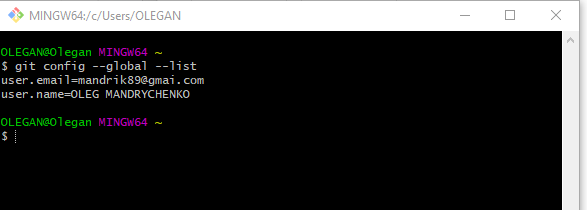
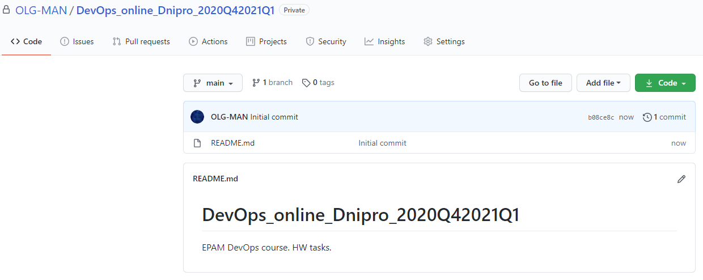
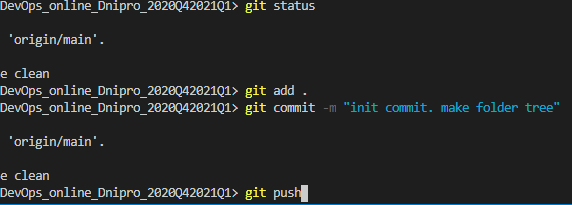
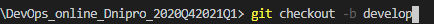
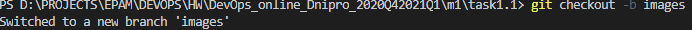
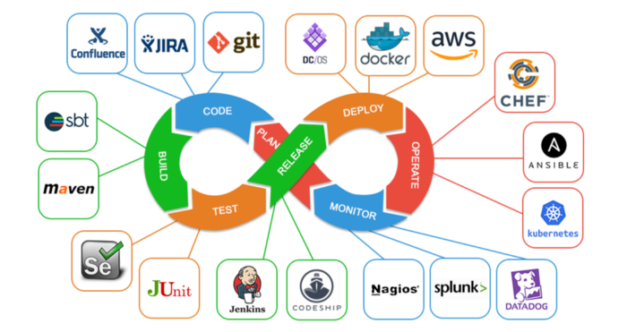
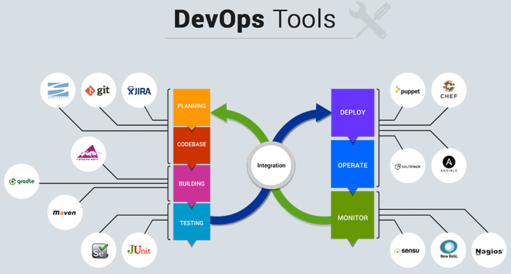
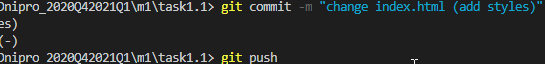

# Task 1
**Describe  working with GIT**
- Config and check my globals
 
- Created repo on GitHub 
 
- Clone repo to localhost
 
- Make folders tree
 
- Make branch develop
`git checkout -b develop`
 
- Create index.html
- Make branch images
`git checkout -b images`
 
- add images 
 
 
 
- change index.html
- Make branch styles
`git checkout -b styles`
- add style and change index.html (add styles.css)
    * {
        margin: auto;
        background-color: azure;
    }
 
- go to develop branch
`git checkout develop`
- merge **styles** and **images** branches to **develop**
`git merge styles`
`git merge images`
 
- go to main branch
`git checkout main`
- merge **develop** to **main** branch
`git merge develop`
------------
