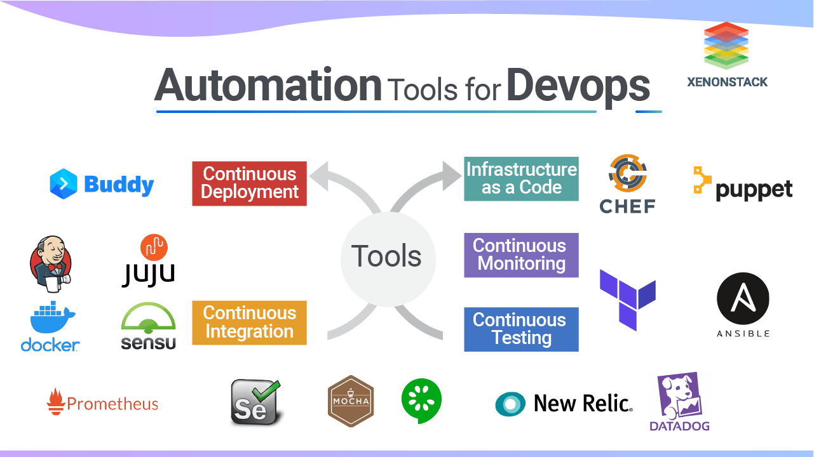

# Task 1.1
**Describe  working with GIT**

1. Config and check my globals
* 

2. Created repo on GitHub 
* 

3. Clone repo to localhost
* 

4. Make folders tree
* 

5. Make branch develop
`git checkout -b develop`
* 

6. Create index.html
- Make branch images
`git checkout -b images`
* 

7. add images 
* 
* 
* 

8. change index.html
9. Make branch styles
`git checkout -b styles`
10. add style and change index.html (add styles.css)

* 

11. go to develop branch
`git checkout develop`
12. merge **styles** and **images** branches to **develop**
`git merge styles`
`git merge images`
* 

13. go to **main** branch
`git checkout main`
14. merge **develop** to **main** branch
`git merge develop`
------------
**What is DevOps?**

I can write that DevOps is  Methodologies or Culture or Philosophy, and it's true. But in real first of all, it's about 
* Creating an Environment for development.
* Configure project and development instances.
* Creating virtual networks for infrastructure or projects.
* Support ci/cd processes.
* Make coding, delivering, and deployment more easier and automatic.