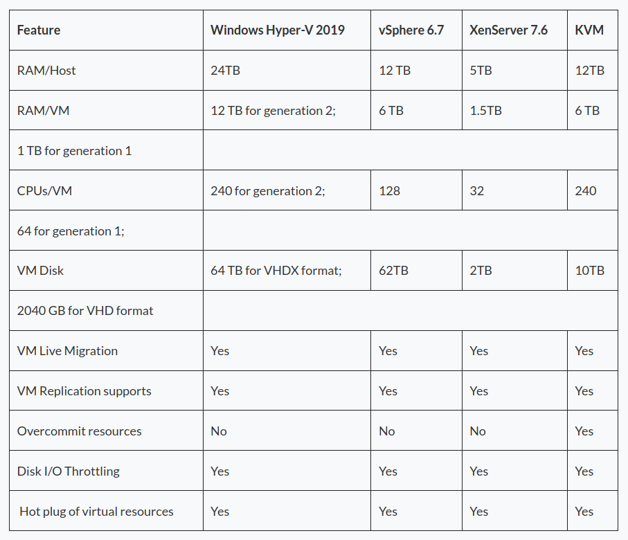
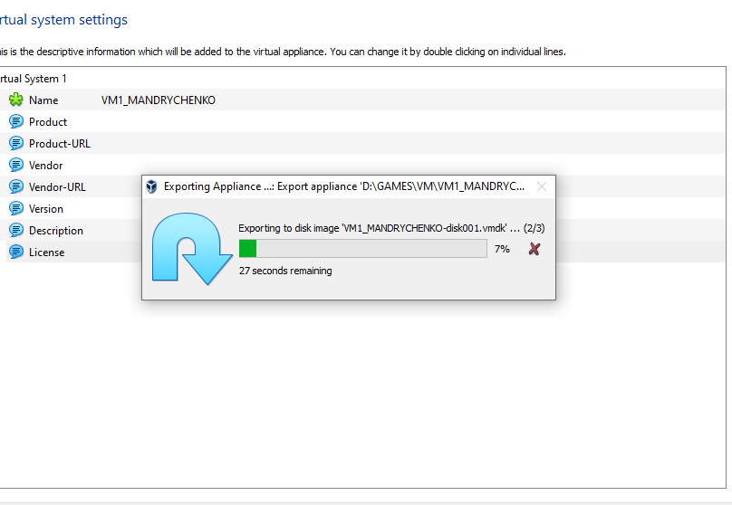
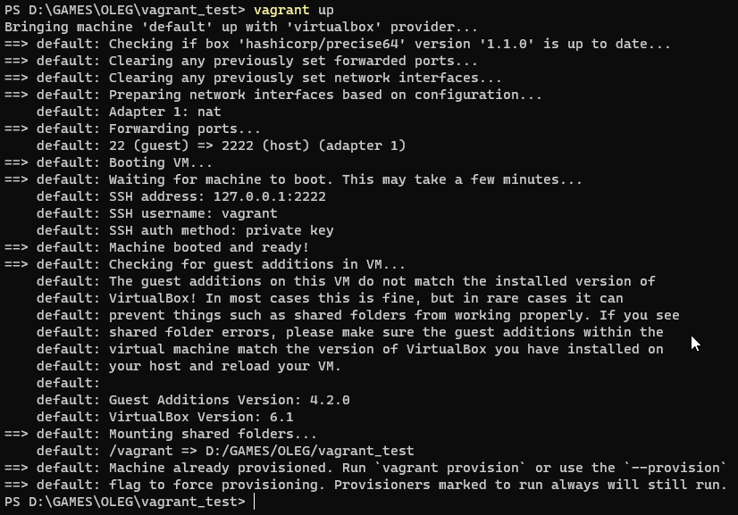

# Task 2.1
## Part 1
### **Most Popular Hypervisors.**

1. Type-1. Native Hypervisors.
* VMware ESX
* Citrix XenServer
* Microsoft Hyper-V
* Oracle VM Server for SPARC
* Oracle VM Server for x86
* Nutanix AHV

2. Type-2. Hosted Hypervisors.
* VirtualBox 
* VMware Workstation
* Microsoft Virtual PC
* QEMU 
* Parallels Desktop for Mac

### **Features of popular Hypervisors**

1. Citrix XenServer
* Multi-server management
* Dynamic Memory Control
* Live VM migration
* Site Recovery
* Host Failure Protection
* Active Directory Integration
* Heterogeneous Resource Pools
* Intellicache
* GPU Virtualization
* Nested Virtualization for Bromium Secure Platform

2. Microsoft Hyper-V
* Persistent memory support.
* Shielded VM updates.
* Simple Two-Node clusters.
* ReFS Deduplication.
* Storage Spaces Direct improvements.
* Windows Admin Center.
* Encrypted subnets.

3. Red Hat KVM
* Scalability.
* Overcommit resources.
* Disk I/O throttling.
* Hot plug of virtual resources.
* Low cost virtualization solution.
* Red Hat Enterprise Virtualization programming & API.
* Disaster Recovery support.
* Red Hat Satellite integration.

4. VMware vSphere
* It abstracts memory, processors, storage and other resources into multiple VMs.
* vCenter Server: Centralized management tool to configure, provision and manage virtual IT environments. 
* vSphere Client: vSphere 6.7 has the final version of Flash-based vSphere Web Client. 
* vSphere SDKs: Provides interfaces for third-party solutions to access vSphere.
* VM File System: A cluster file system for VMs.
* Virtual SMP: Enables a single VM to use multiple physical processors at a time.
* vMotion: Enables live migration with transaction integrity.
* Storage vMotion: Enables VM file migration from one place to other without service interruption.
* High Availability: If one server fails, VM is shifted to another server with spare capacity to enable business continuity.
* Distributed Resource Scheduler (DRS): Assigns and balances compute automatically across hardware resources available for VMs.
* Fault Tolerance: Generates copy of primary VM to ensure its continuous availability.
* Distributed Switch (VDS): Spans multiple ESXi hosts and enables considerable reduction of network maintenance activities and increases network capacity.
* Network & Storage I/O Control.
* Hot add CPU and RAM resources.

**Comparsion table of hypervisors**
* 

## Part 2

### **Work with VirtualBox**

1. VirtualBox already installed on my host
* 

2. Create VM1
* 

3. Install Ubuntu
* 

4. Make Clone VM
* 
* 

5. Make Group of VM's
* 

6. Make snapshots of VM1
* 

7. Export VM1 to .ova file.
* 
* 

-----------

### **Configuration of virtual machines**

1. Explored VM Settings.

2. Configure connect from host USB port to guest USB port.
* 
* 
* 

3. Configure Shared folder beetween host and guest.
* 
* 
* 
* 

-----------

4. Configure different network modes for VM1, VM2.

### **Connection Table**
* 

### **NAT mode connection.**
* 
* 
* 
* 

### **Bridged mode connection**
* 
* 
* 
* 

### **Internal network connection**
* 
* 
* 
* 
* 

### **Host-only adapter connection**
* 
* 

-----------

## **VBoxManage**

1. list vms command
* 

2. Showvminfo command
* 

3. creatvm command
* 

4. startvm command
* 

5. modifyvm command
* 

6. clonevm command
* 

7. snapshot command
* 

8. controlvm command
* 

-----------

## Part 3

### **Vagrant**

1. Create folders
* 

2. Initialized the environment with the default Vagrant box
* 

3. Start default vagrant vm 
* 

4. Connect to vm by ssh
* 
* 

5. Check Date
* 

6. Stop and delete VM
* 

7. Create own vagrant box
* 

-----------

