# Task 2.2

## AWS Basics

**Lightsail Instance**

1. Already register in AWS 

* 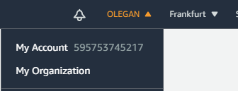

2. Create Instance and make new SSH key for VM

* 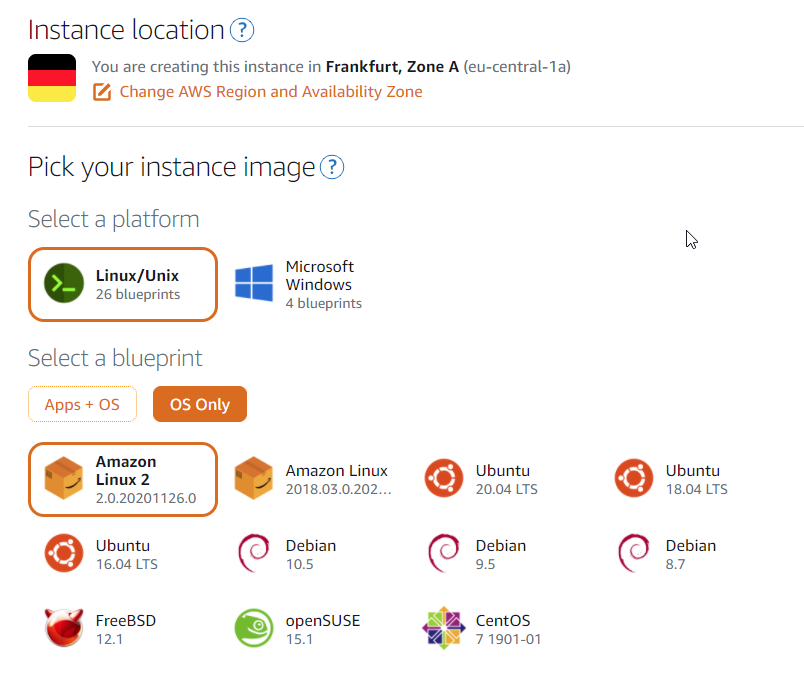

* 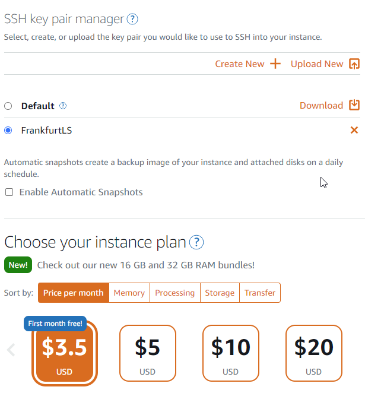

* 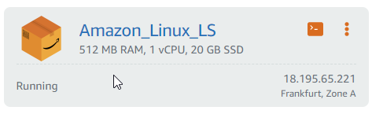

3. Connect to VM by aws web cli and mobaxterm

* 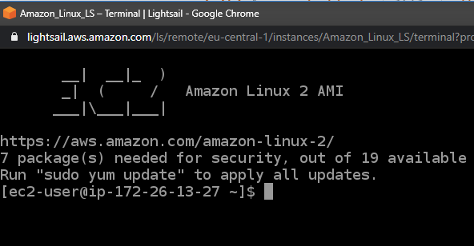

* 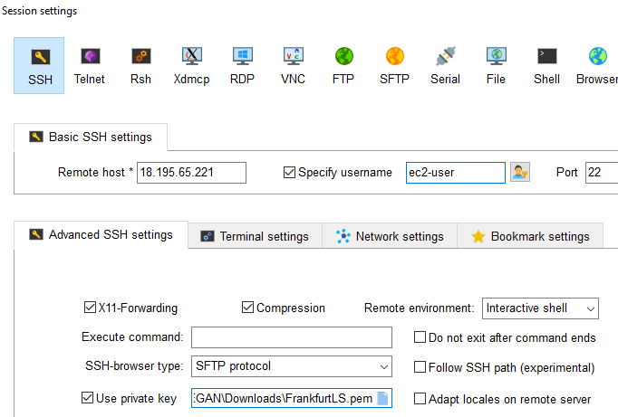

* 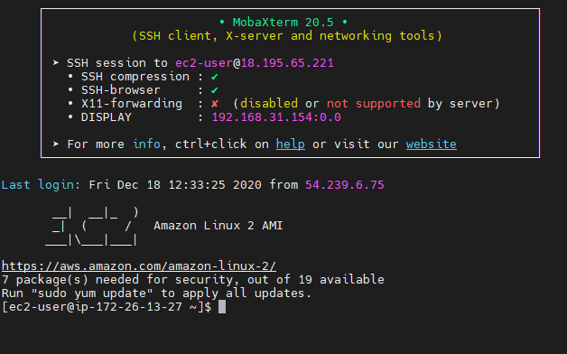

**EC2 Instance**
 
1. Create instance and create new ssh key.

* 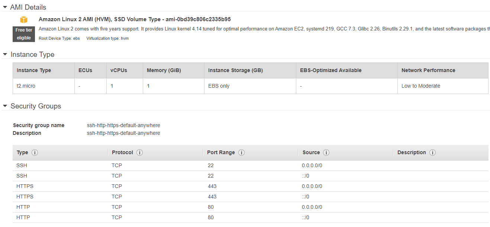

* 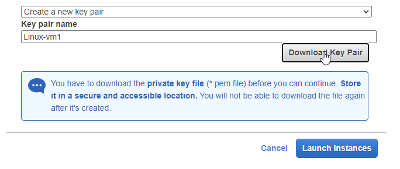

* 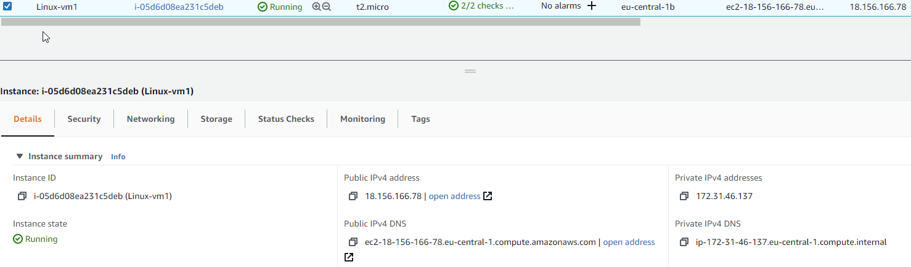

2. Connect to instance by aws web cli and mobaxterm

* 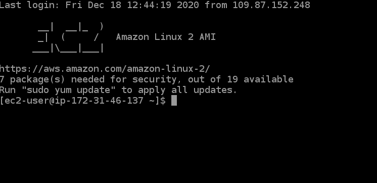

* 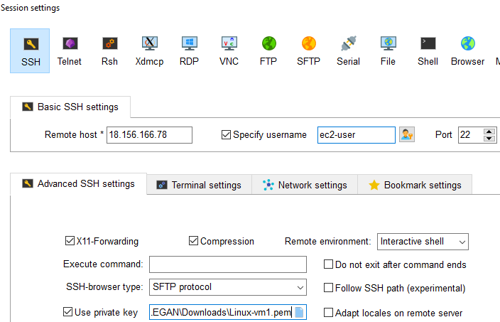

* 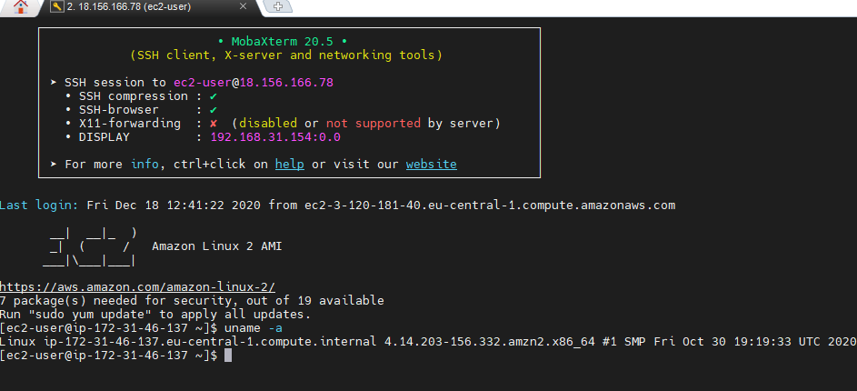

**Instance volumes**

1. Create and attach volume Disk_D

* 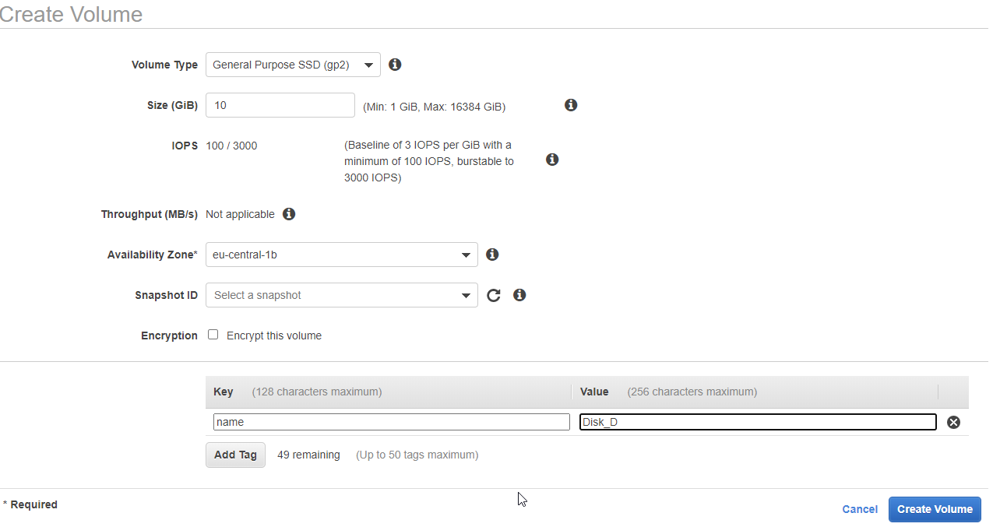

* 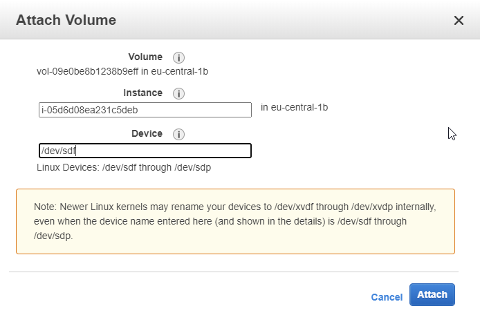

2. Format and mount a Disk_D. Create file index.html

* 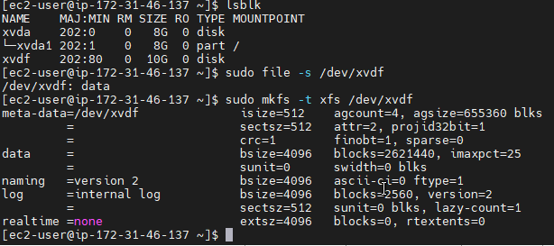

* 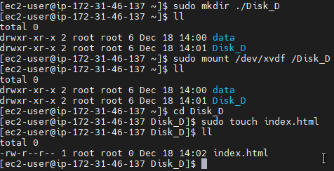

**Create instance from backup**

1. Create image from instance snapshot

* 

* 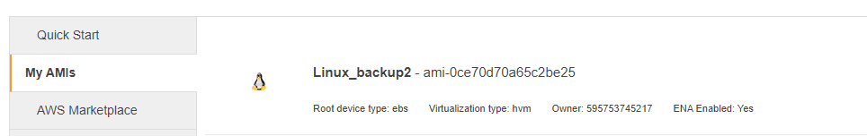

* 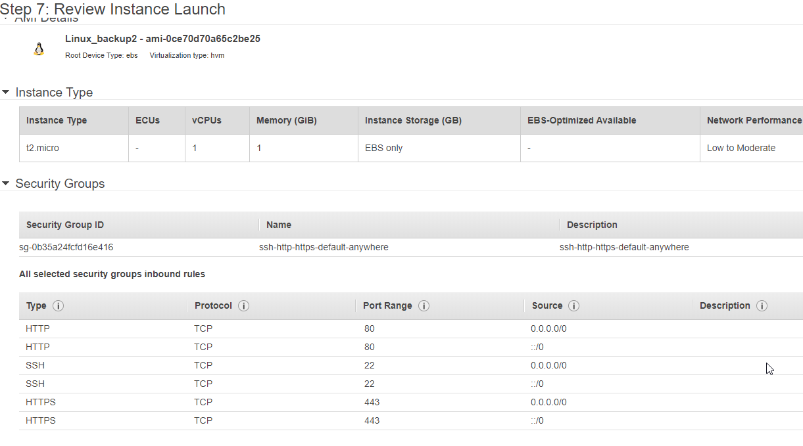

2. Detach/Attach volume Linux-vm1 -> Linux-backup

* 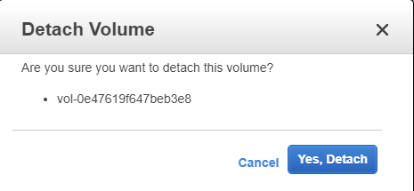

* 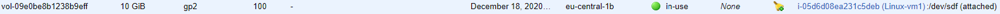

* 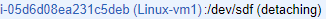

* 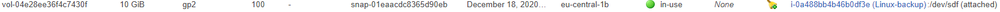

* 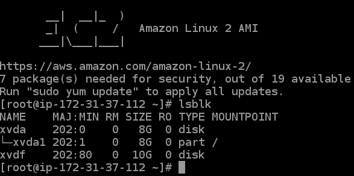

**Launch and configure a WordPress instance with Amazon Lightsail**

1. Create WP instance in Lightsail

* 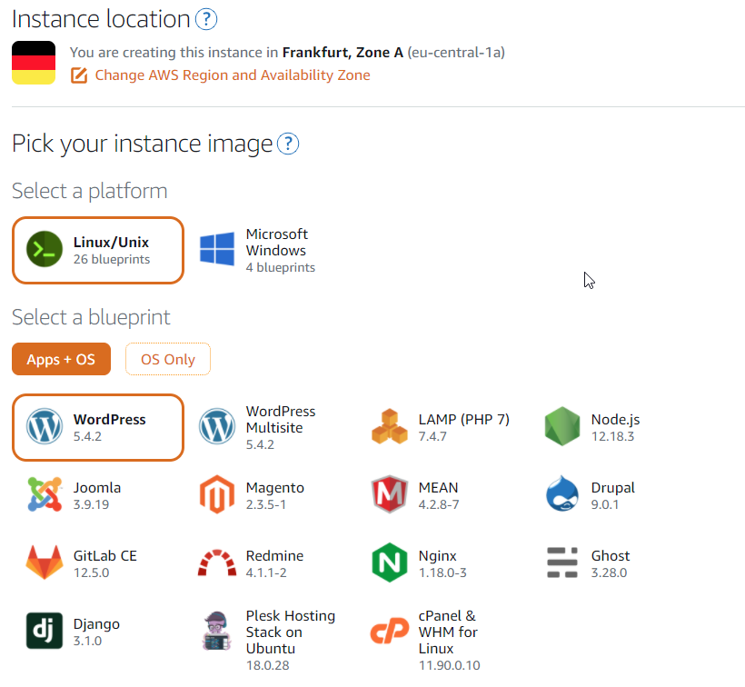

* 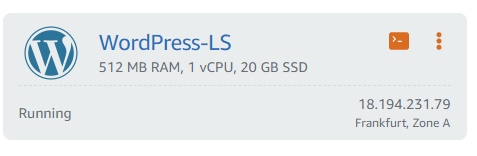

**Create S3 Bucket**

1. Create Bucket

* 

* 