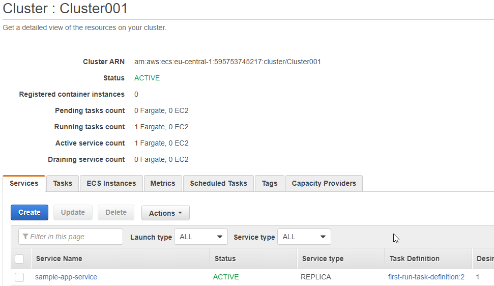

# Task 2.2

## AWS Basics

##**Lightsail Instance**

1. Already register in AWS 

* 

2. Create Instance and make new SSH key for VM

* 

* 

* 

3. Connect to VM by aws web cli and mobaxterm

* 

* 

* 

##**EC2 Instance**
 
1. Create instance and create new ssh key.

* 

* 

* 

2. Connect to instance by aws web cli and mobaxterm

* 

* 

* 

##**Instance volumes**

1. Create and attach volume Disk_D

* 

* 

2. Format and mount a Disk_D. Create file index.html

* 

* 

##**Create instance from backup**

1. Create image from instance snapshot

* 

* 

* 

2. Detach/Attach volume Linux-vm1 -> Linux-backup

* 

* 

* 

* 

* 

##**Launch and configure a WordPress instance with Amazon Lightsail**

1. Create WP instance in Lightsail

* 

* 

##**S3 Bucket**

1. Create Bucket

* 

* 

2. Create user in IAM with and copy file to S3 bucket by aws cli

* 

* 

* 

* 

* 

* 

##**Create domain**

1. Explore the possibilities.

2. Also already created an instance for my needs with elastic IP and OpenVPN server.

* 

* 

##**Amazon ECS**

1. Create cluster and run demo app in ECS.

* 

* 

* 

* 

* 

##**Static website Amazon S3**

* Already created and modified web-app for this task.
  Link to my repo https://github.com/OLG-MAN/testapp-cicd-aws

* Using Elastic Beanstalk (Python app), S3 bucket for zip files, and Github actions
  for ci/cd proccess (main.yaml file).

* All proccess going by this way
  Github commit -> GH actions ci/cd parts -> creating zip file from code and 
  copy to S3 bucket -> Create new version of EB and update from S3 bucket zip file.

* 

* 

* 

* 

* 

* 

* 

* 

* 

* Site Link http://testdevapp-env.eba-mykqyihe.eu-central-1.elasticbeanstalk.com/

----------------
