# Task 3.1

## PART 1

### 1. Install ad configure MySQL.

* 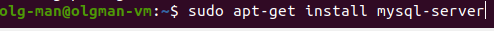
* 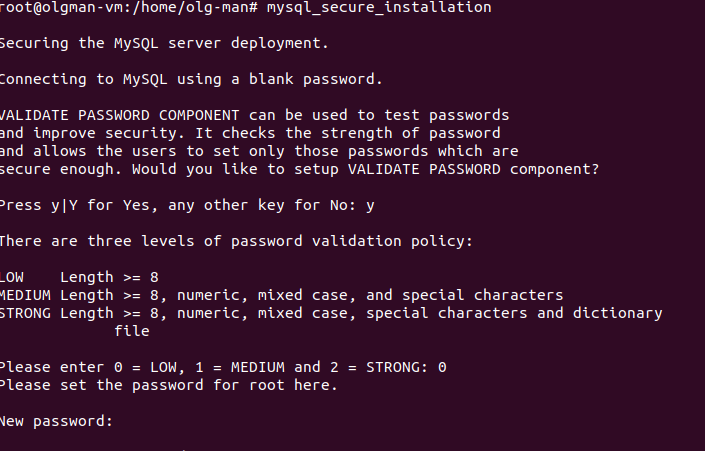
* 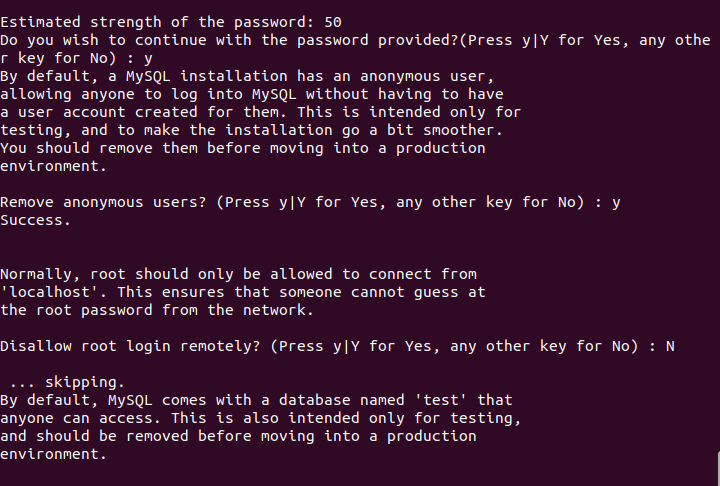
* 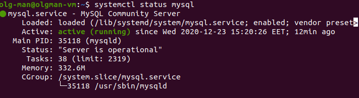

### 2. Create Database and tables.

* 
* 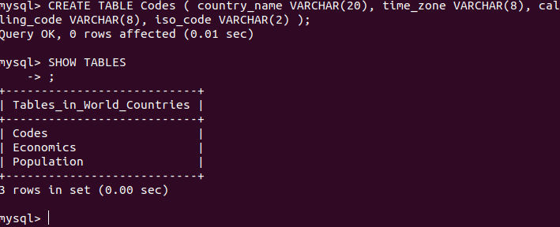
* 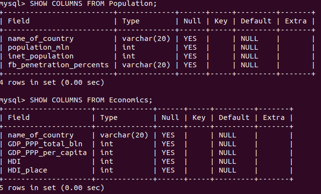
* 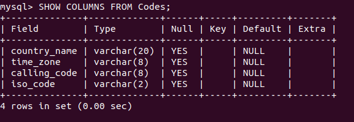

### 3. Fill data in tables.

* 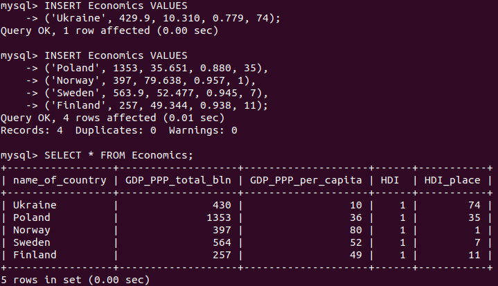
* 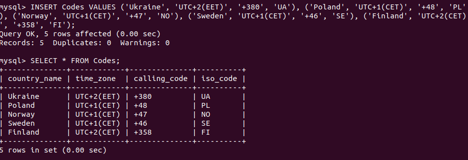

### 4. SQL queries. DDL(Data Definition Lnguage).

* 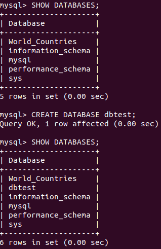
* 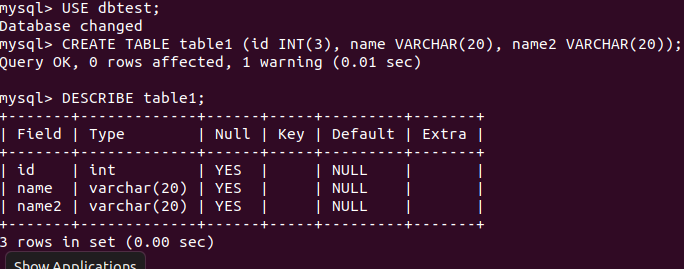
* 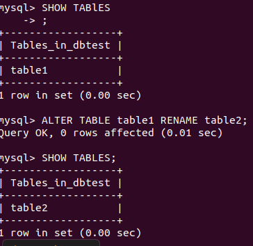
* 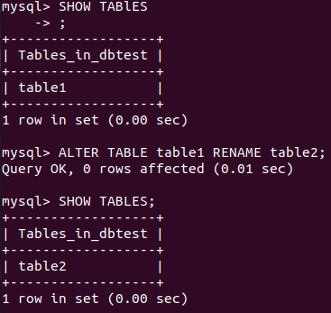
* 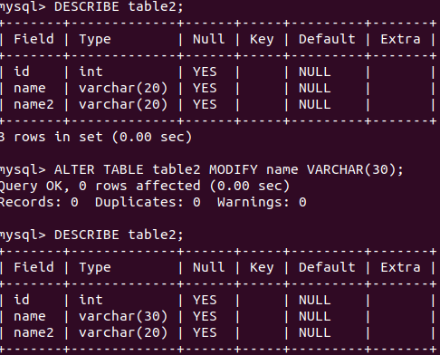
* 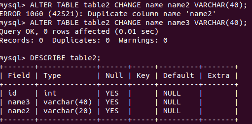
* 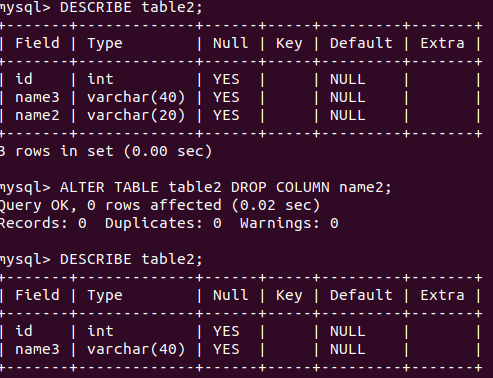
* 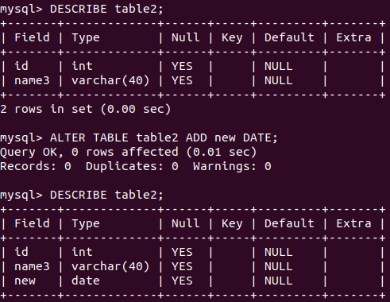
* 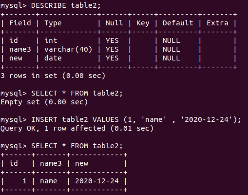
* 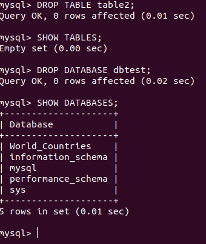
* 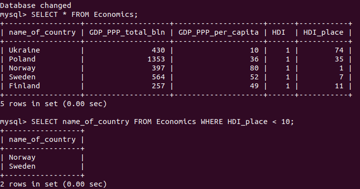
* 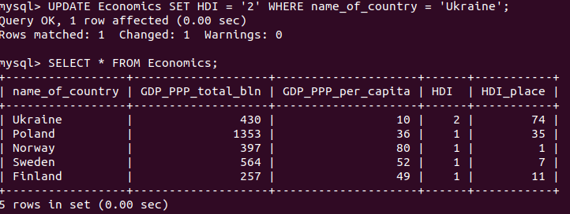
* 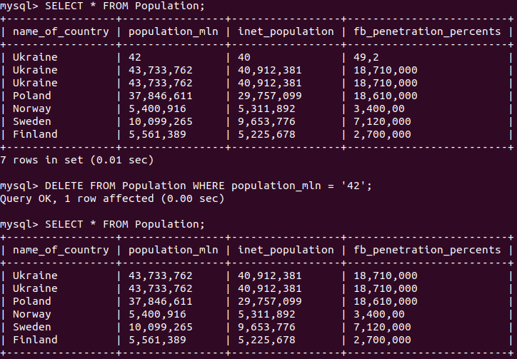

### 5. SQL queries. DCL(Data Control Language). 
* Create User queries. Privileges. Connect to DB from another user.

* 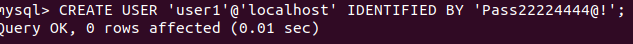
* 
* 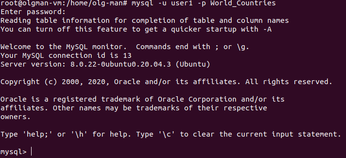
* 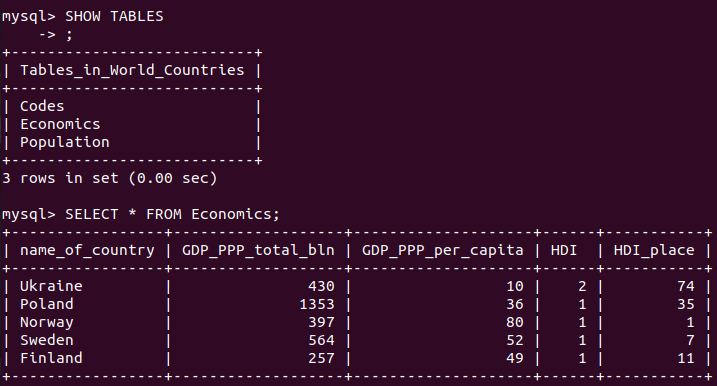
* 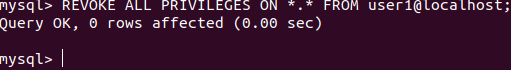
* 
* 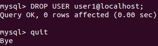

## PART 2

### 1. DB Backup. 

1. Create backup of DB. Delete some tables and restore it from backup.

* 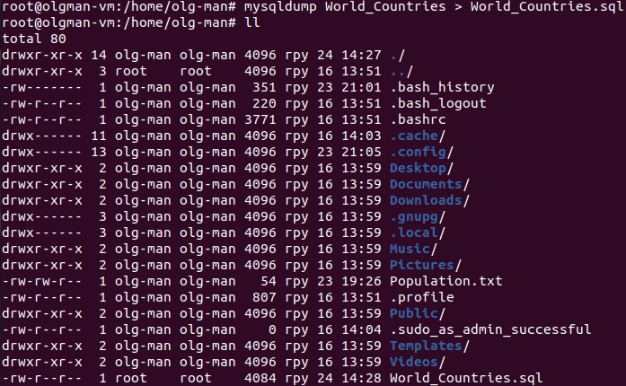
* 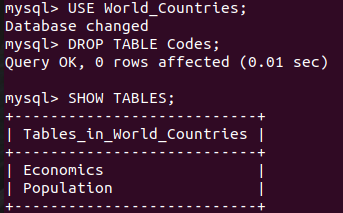
* 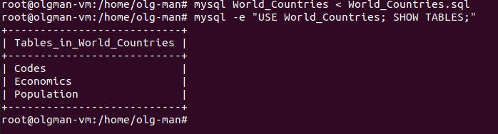

2. Create AWS RDS DB. Connect to RDS. Edit Security group and Public access.

* 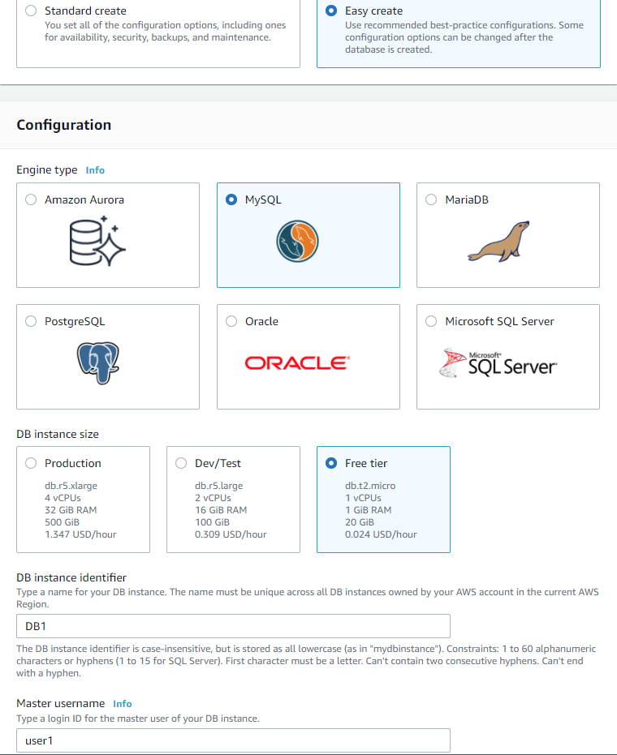
* 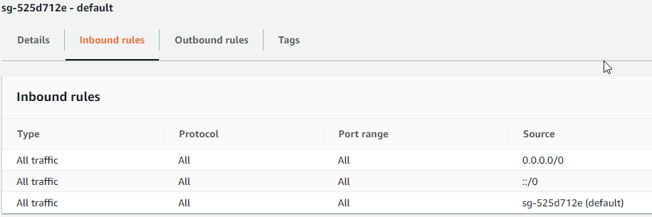
* 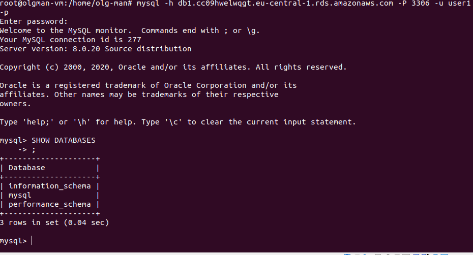
* 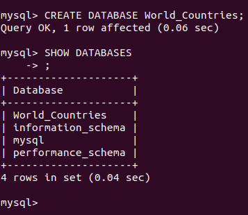
* 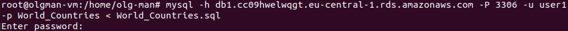
* 

## PART 3

### Dynamo DB.

1.Create DynamoDB table.

* 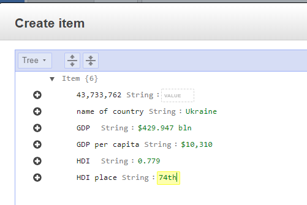
* 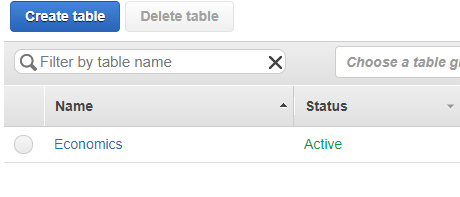

--------------------