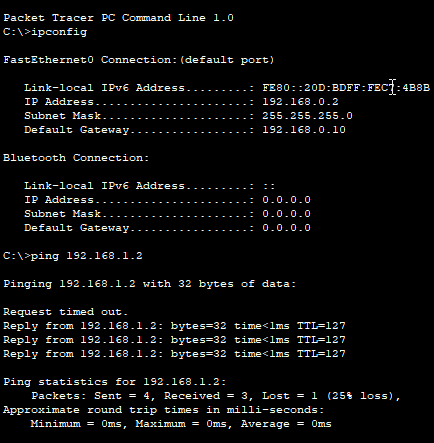

# Task 4.1

## Networks

### 1. Create 1st project. Testing Network. 

* 
* 
* 
* 

### 2. Delete IP's and PC's can't connect each others.

* 

### 3. Create 2nd project. Testing Network. 

* 
* 
* 

### 4. Create 3rd project. Testing Network.
   The difference with the hub connection is that packets from the hub go to each network member. Packets from the switch go to the destination computer. 

* 
* 
* 

### 5. Expanded the network. Second switch. Testing.

* 
* 

### 6. Dividing the network into two subnets. Testing.

* 
* 

### Also in "projects" folder all saved projects from task.

---------------------------------------------

