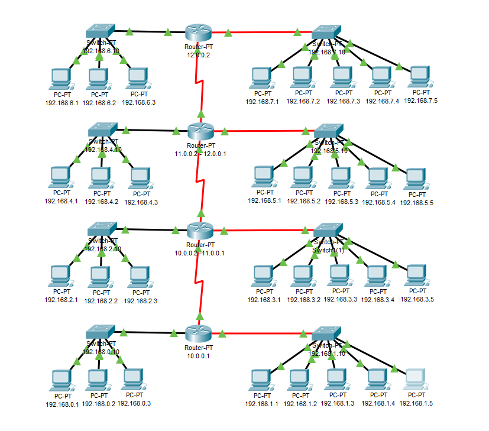
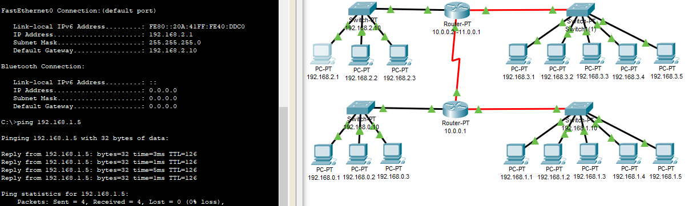
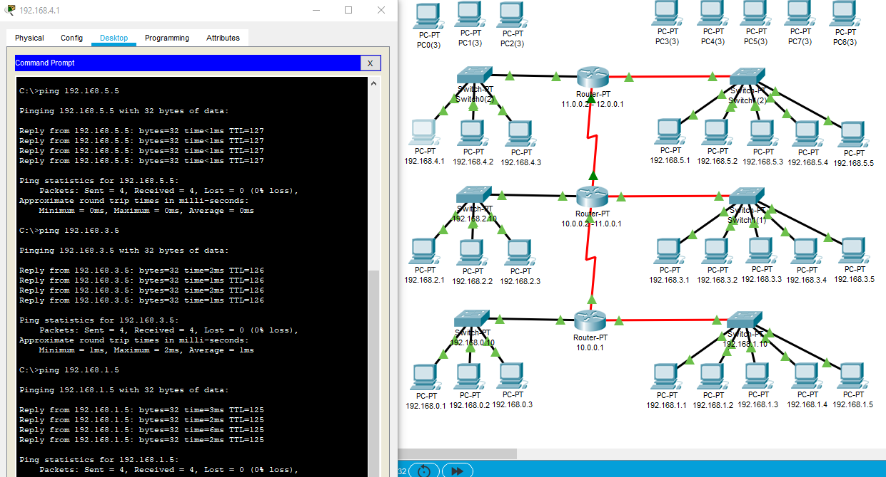
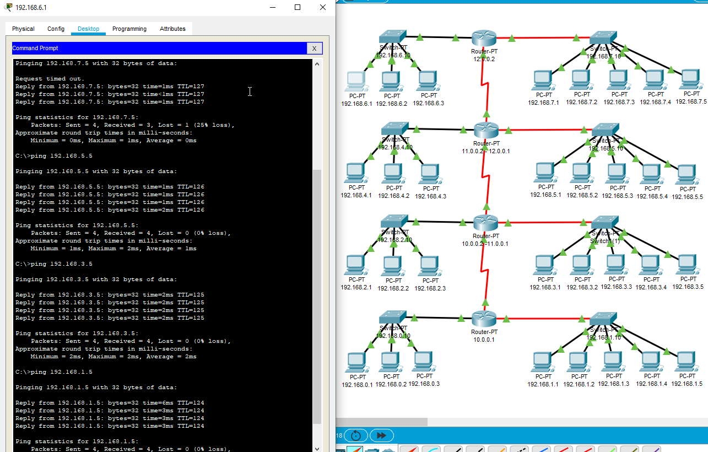
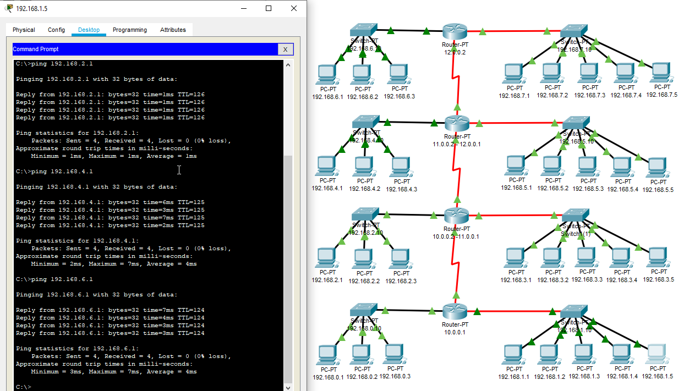

# Task 4.2

## Networks

### 1. Create and testing task 1 project. 

* 
* 
* 
* 

### 2. Create and testing task 2 project. 

* All Project 

* 

* Check and testing 2 floors.

* 

* Check and testing 3 floors.

* 

* Check and testing 4 floors. All network.

* 

* 

### 2. Create and testing task 3 project. 

