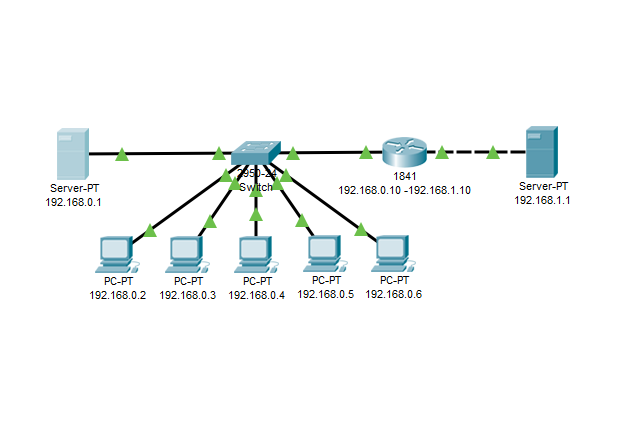
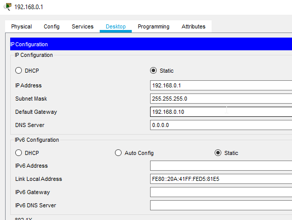
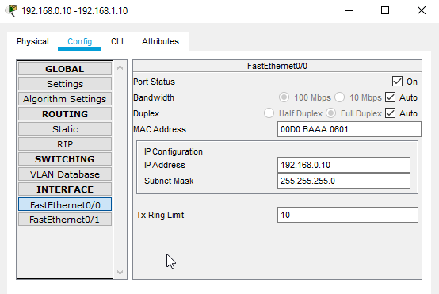
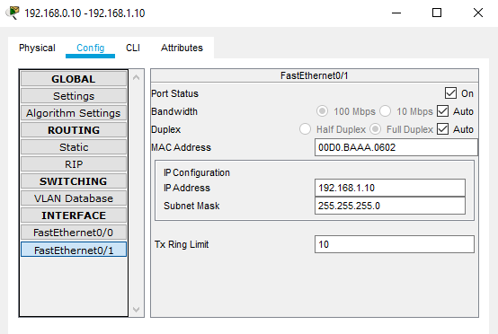
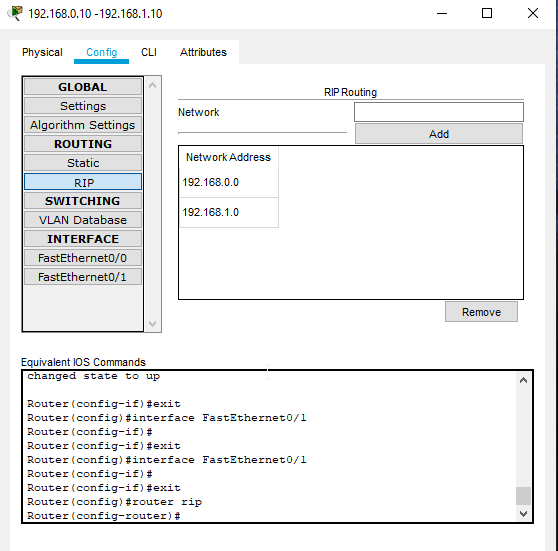
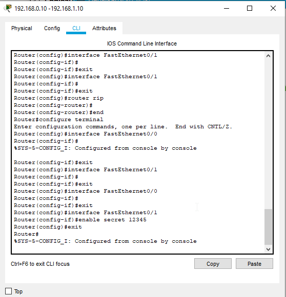
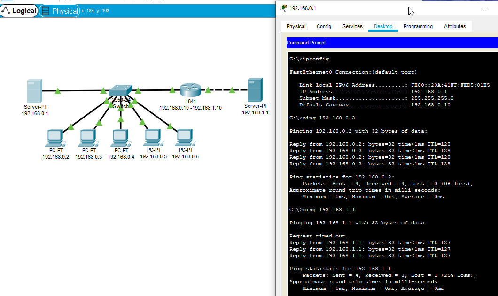
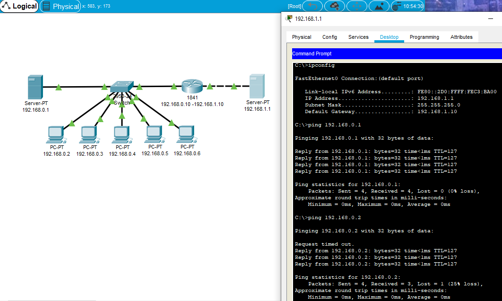

# Task 4.3

## Networks

### 1. Create and testing task 1 project. 

* ### All Projrct view. 

* 

* ### Configure static ip.

* 

* ### Configure gateway.

* 

* 

* ### Configure RIP routing

* 

* ### Configure router password

* 

* ### Testing network.

* 

* 

* ### Project saved in same folder.

--------------------------------------------

