# Task 4.4

## Networks

### 1. Task 1 project. 

### Projects with 2 routers network already created in task 4.2

* 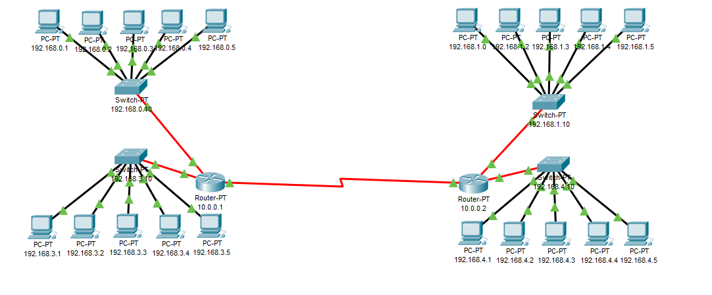

* 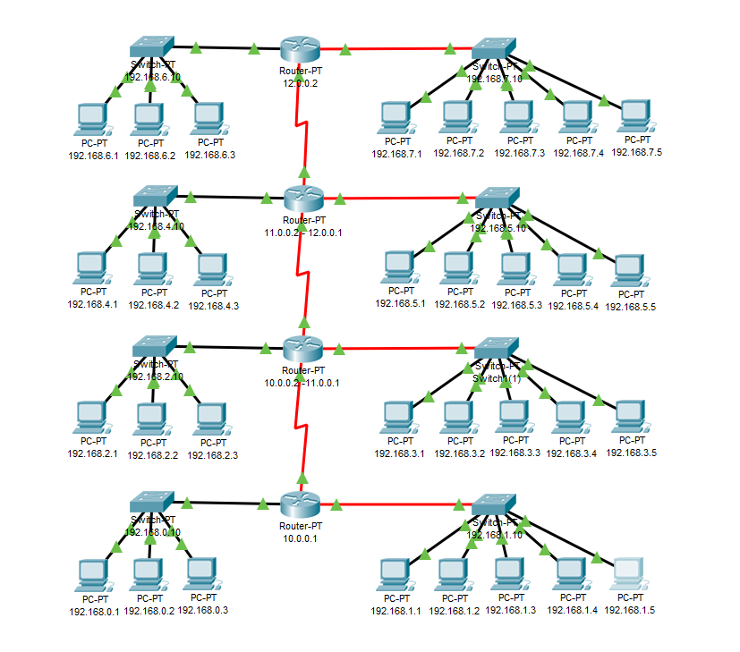

### 2. Create and testing Task 2 project.

* ### All Project view. 

* 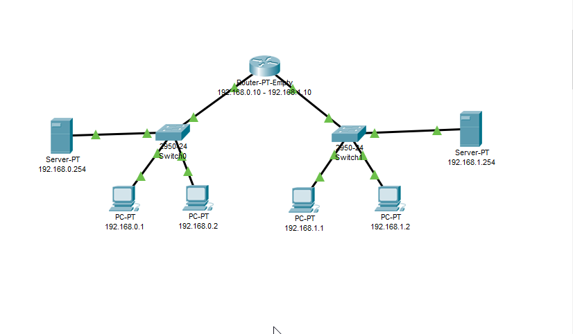

* ### Configure PCs.

* 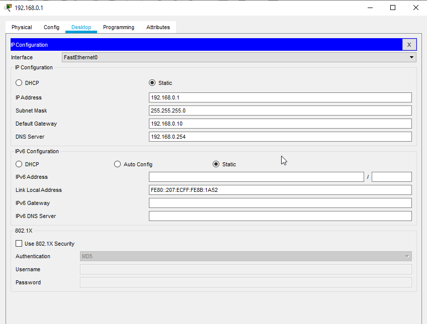

* ### Configure DNS server.

* 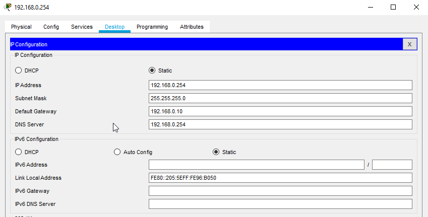

* ### Configure Router.

* 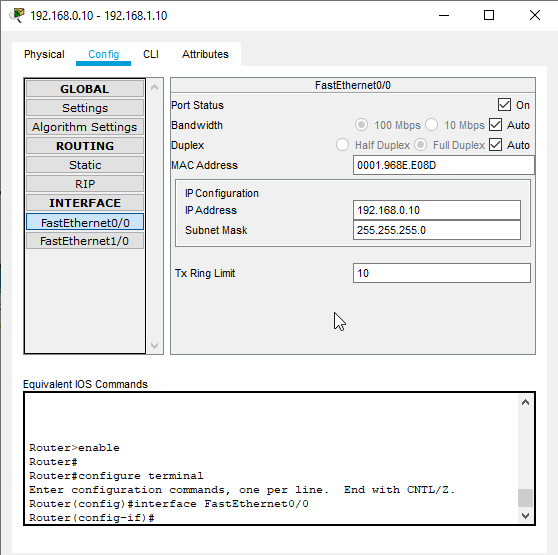

* ### Create DNS records.

* 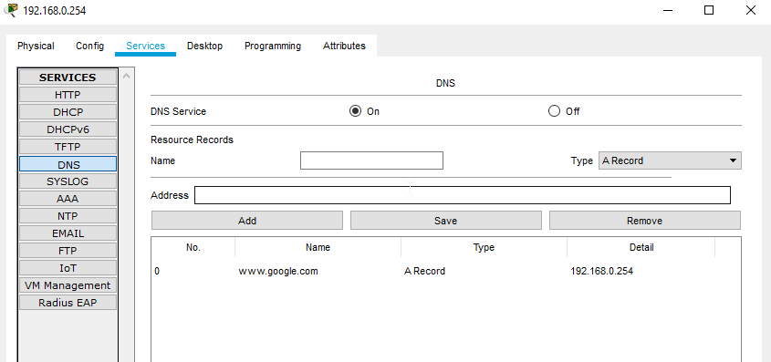

* ### Check correct and wrong address in PC web browser.

* 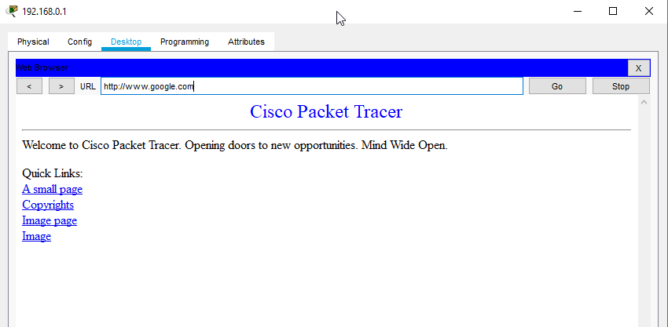

* 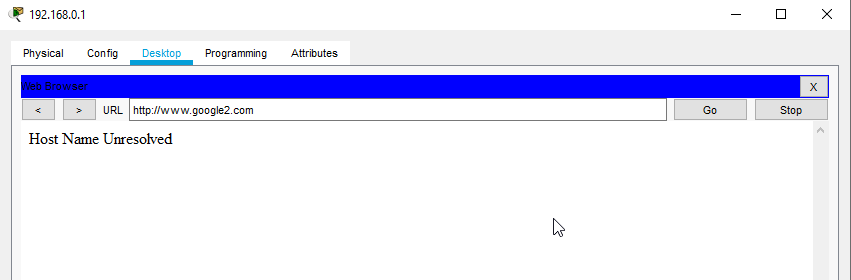

* ### Configure second DNS server. Add records from first DNS server.

* 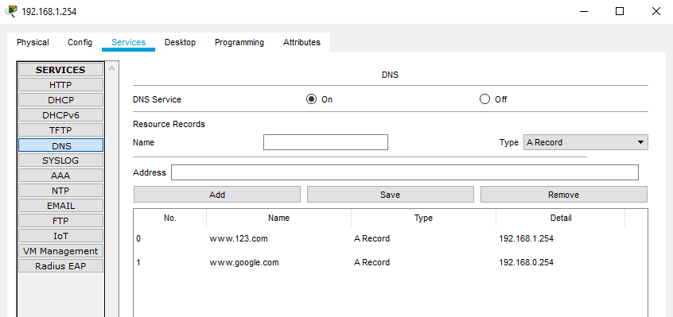

* ### Check addresses from the first and second DNS servers in different subnets.

* 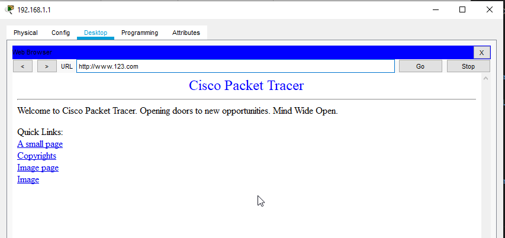

* 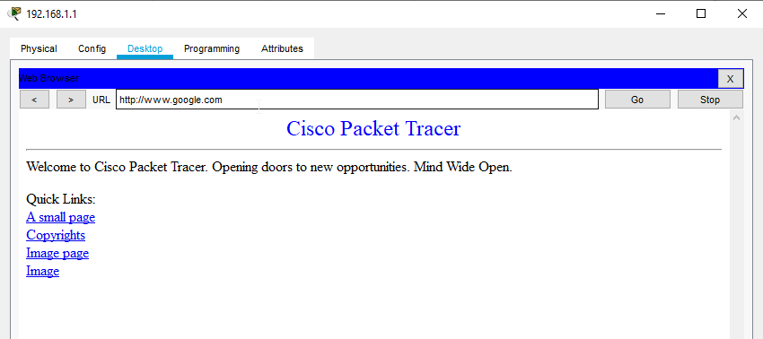

* ### Testing network from host and server.

* 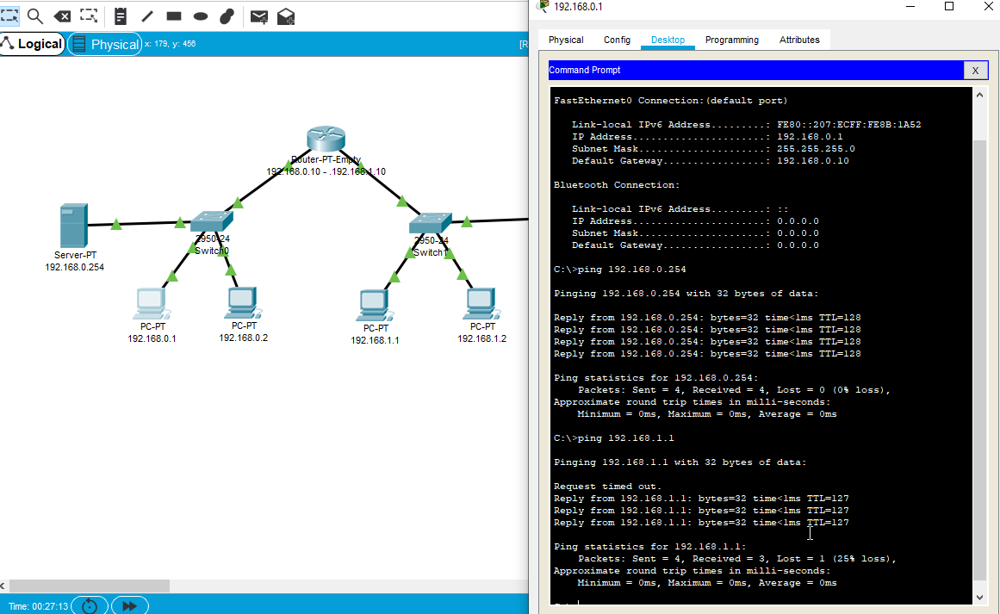

* 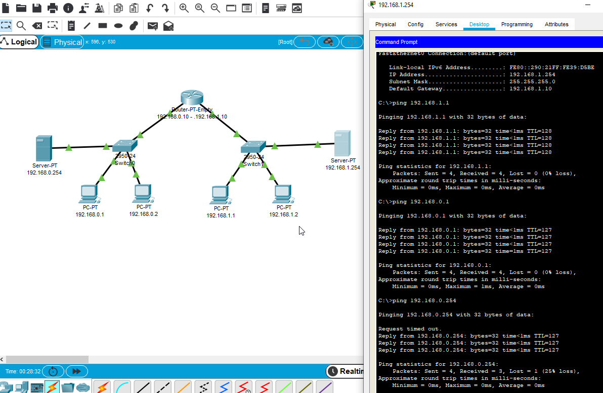

* ### Project saved in same folder. 

--------------------------------------------

