# Task 5.1

## Linux

### Part 1.

1. ### Log in to the system as root.

* 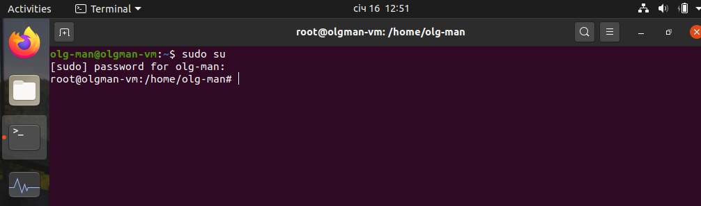

2. ### Changed password. Looking commands options. File etc/shadow changes when you use this command. Changed password hash below in images.

* 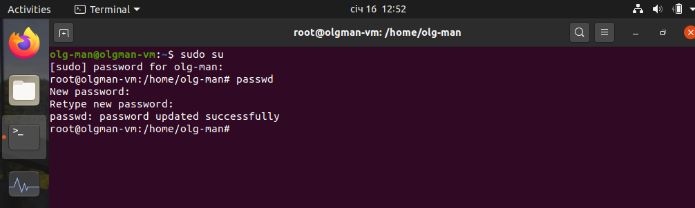

* 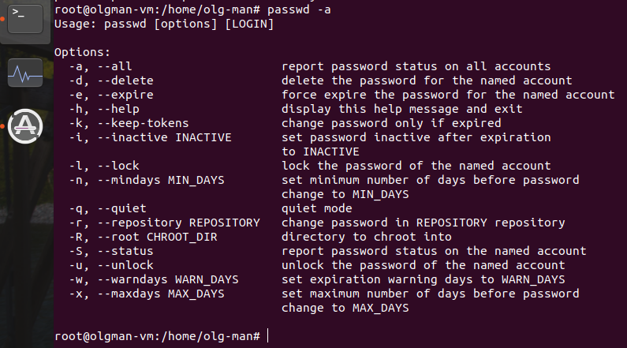

* 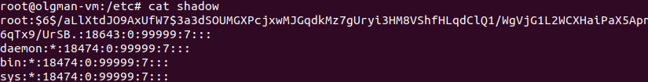

* 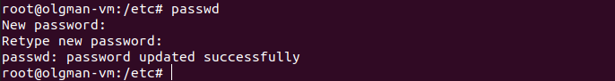

* 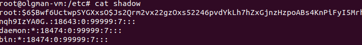

3. ### Look at users who are in the system. And last logins.

* 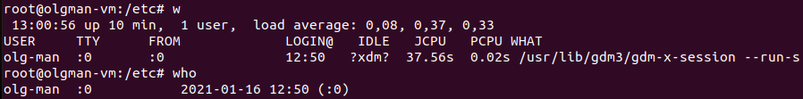

* 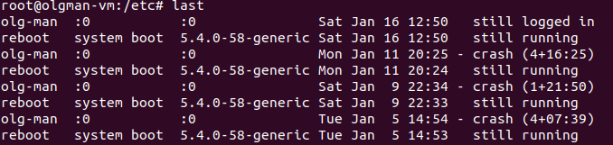

4. ### Changing user information. Can't change my user name because he is busy with process. Create new user, change info of new user.

* 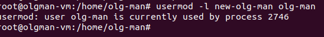

* 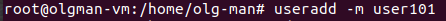

* 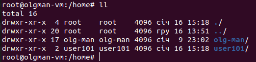

* 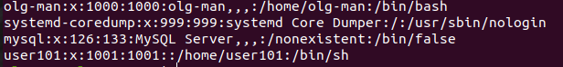

* 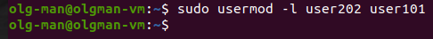

* 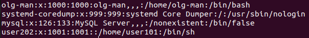

5. ### Explore man and help commands.

* 

6. ### Explore and use more and less commands.

* 

7. ### Finger command.

* 

8. ### ls command.

* 

