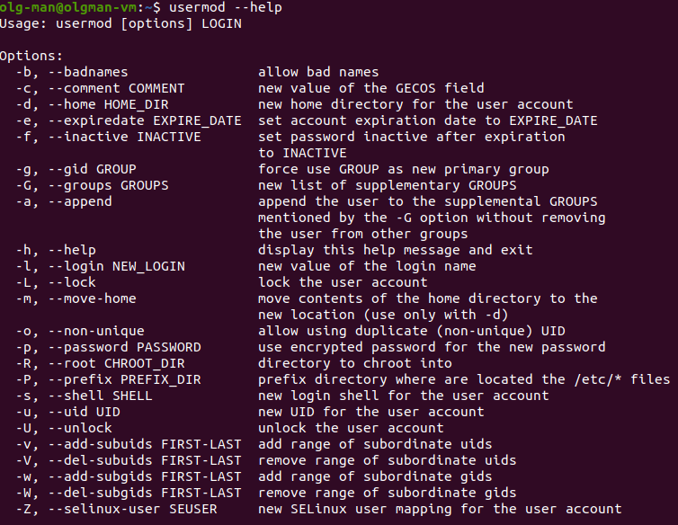

# Task 5.1

## Linux

## Part 1.

1. ### Log in to the system as root.

* 

2. ### Changed password. Looking commands options. File etc/shadow changes when you use this command. Changed password hash below in images.

* 

* 

* 

* 

* 

3. ### Look at users who are in the system. And last logins.

* 

* 

4. ### Changing user information. Can't change my user name because he is busy with process. Create new user, change info of new user.

* 

* 

* 

* 

* 

* 

5. ### Explore 'man' and 'help' commands.

* 

* 

* 

6. ### Explore and use 'more' and 'less' commands.

* 

* 

* 

* 

* 

7. ### 'finger' command.

* 

* 

8. ### 'ls' command.

* 

* 

* 

----------------------------------

## Part 2.

1. ### 'tree' command, install, use with different keys.

* 

* 

* 

* 

* 

* 

2. ### 'file' command.

* 

* 

3. ### Navigation commands. Absolute and relative paths. Go to "home" directory by 'cd' command.

* 

* 

4. ### 'ls' command different keys. 'l' key - it's long listing format. 'a' 'all'  key - it's do not ignore entries with '.' 

* 

* 

* 

5. ### CRUD operations with folders and files.

* 

* 

* 

* 

6. ### link operations with files. After deleting source file symlink is not working.

* 

* 

* 

* 

* 

* 

7. ### 'locate' command

* 

* 

8. ### Partitions mounted in system

* 

* 

9. ### 'wc' command

* 

* 

10. 11.  ### 'find' command. 'grep' command

* 

* 

* 

* 

12. ### Save content in file by stream operations.

* 

* 

13. ### Type of devices in system, hardware information.

* 

* 

* 

* 

14. ### Type of files in system. Types - text files, executable files, images files, archive files, library (program) files, etc.

* 

* 

15. ### Find last modified files, save them to txt file and list of 5 recent files.

* 

* 

-----------------------------

