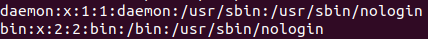

# Task 5.2

## Linux

1. ### Analize files /etc/passwd and /etc/group

* There is lines of processes , pseudo-users and regular users in /etc/passwd. 

* Every line have 
username: pswd: uid: gid: uid comments: directory: shell.

* 

* 

* 

* 

* Users on screenshots is 'root', 'olg-man' and 'user202'.

* 

* 

* 

* Pseudo-users is like 'daemon', 'bin', 'nobody' and others.

* 

* 

* /etc/group containes from 'group_name', 'password' and 'group_id'.

* 

* 

* 

2. ### What are the uid ranges? What is UID? How to define it?

* UID from 1 to 999 it's system processes, daemons, pseudo-users etc. And from 1000+ it's regular users in system.

3. ### What is GID? How to define it?

* This is unique Group ID number in system. You can define both in  /etc/passwd and /etc/group. 

* 

* 

* 

4. ### How to determine belonging of user to the specific group? 

* We can define it in /etc/passwd

* 

* 

4. ### What are the commands for adding a user to the system? What are the basic parameters required to create a user?

* Basic commands to create a user it's 'useradd -m user' after change password 'passwd user' and add to some groups if need 'usermod -aG Group user'

5. ### How do I change the name (account name) of an existing user?

* We can change it by command 'usermod -l new_user_name old_user_name'

6. ### 