# Task 5.3

## Linux
### Part 1

1. ### How many states could has a process in Linux?

* Linux has basically 5 process states.
* Running (R)
* Interruptible Sleep (S) 
* Uninterruptible Sleep (D)
* Stopped (T)
* Zombie (Z)  

2. ### Examine the pstree command. Make output (highlight) the chain (ancestors) of the current process.
* Use 'pstree' command
* 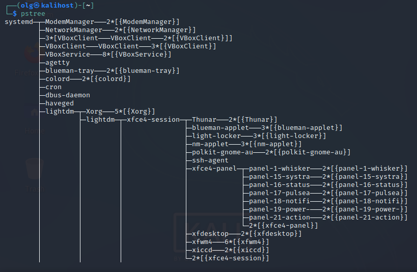

* pstree of different procceses

* 
* 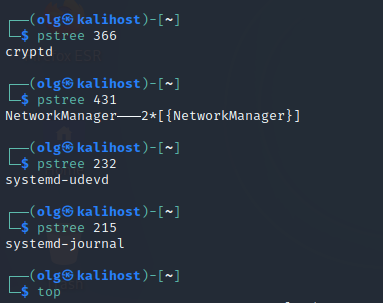

3. ### What is a proc file system?

* The proc filesystem (procfs) is a special filesystem in Unix-like operating systems that presents information about processes and other system information in a hierarchical file-like structure, providing a more convenient and standardized method for dynamically accessing process data held in the kernel than traditional tracing methods or direct access to kernel memory. 

4. ###  Print information about the processor

* 'lscpu' command prints CPU architecture
* '$ cat /proc/cpuinfo' also show cpu by viewing contents of the /proc/cpuinfo
*  $ cat /proc/cpuinfo | grep 'vendor' | uniq	    view vendor name
   $ cat /proc/cpuinfo | grep 'model name' | uniq   display model name
   $ cat /proc/cpuinfo | grep processor | wc -l	    count the number of processing units
   $ cat /proc/cpuinfo | grep 'core id'			    show individual cores

* 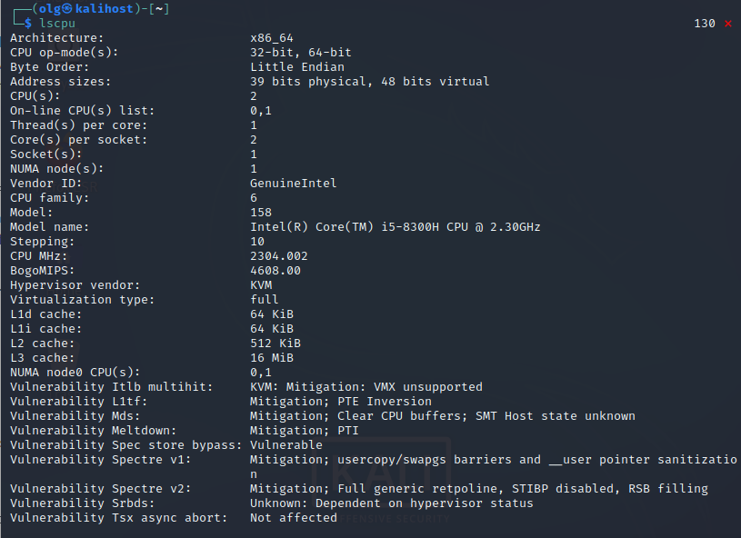

5. ### Use the ps command to get information about the process. The information should be as follows: the owner of the process, the arguments with which the process was launched for execution, the group owner of this process, etc. 

* 'ps' - default proccess info
* 'ps aux' - short summary of the active processes
* 'ps -eF" - all proccess full and lonf info
* 'ps -efH' - all processes with tree mode, show child processes
* 'ps -efL' - view the list of processes with threads
* 'ps -fu username' - list of processes for a specific user
*  'ps fax'  show hierarchical relationships between parent and child processes

6. ### How to define kernel processes and user processes?

* User-space processes have its own virtual address space.

* Kernel processes or threads do not have their own address space, they operate within kernel address space only.

7. ### Print the list of processes to the terminal. Briefly describe the statuses of the processes. What condition are they in, or can they be arriving in?

* 

* D Uninterruptible sleep (usually IO)
* R Running or runnable (on run queue)
* S Interruptible sleep (waiting for an event to complete)
* T Stopped, either by a job control signal or because it is being traced.
* W paging (not valid since the 2.6.xx kernel)
* X dead (should never be seen)
* Z Defunct ("zombie") process, terminated but not reaped by its parent.
   
* < high-priority (not nice to other users)
* N low-priority (nice to other users)
* L has pages locked into memory (for real-time and custom IO)
* s is a session leader
* l is multi-threaded (using CLONE_THREAD, like NPTL pthreads do)

8. ### Display only the processes of a specific user.

* 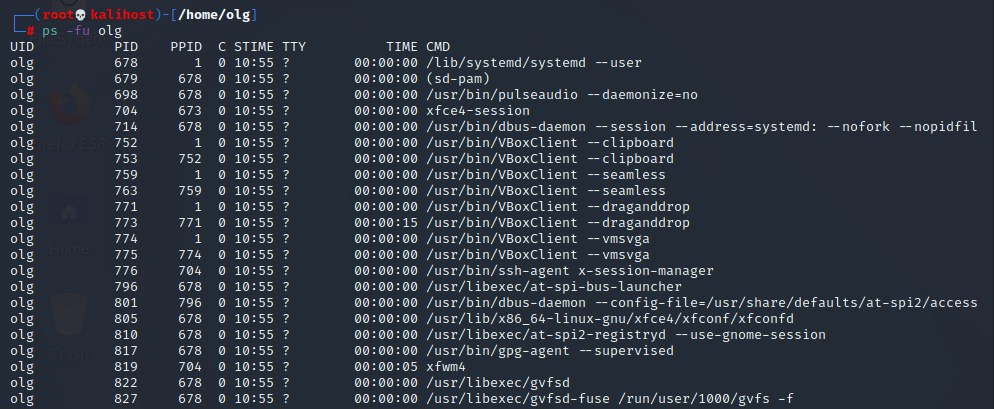

9. ### What utilities can be used to analyze existing running tasks (by analyzing the help for the ps command)?

* List of utilities.
1. top – Linux Process Monitoring
2. htop - also linux process monitoring
3. lotop - process monitoring with  real time Disk I/O and processes

10. ### What information does top command display?

* processes information. system monitoring.

12. ### Display the processes of the specific user using the top command.

* 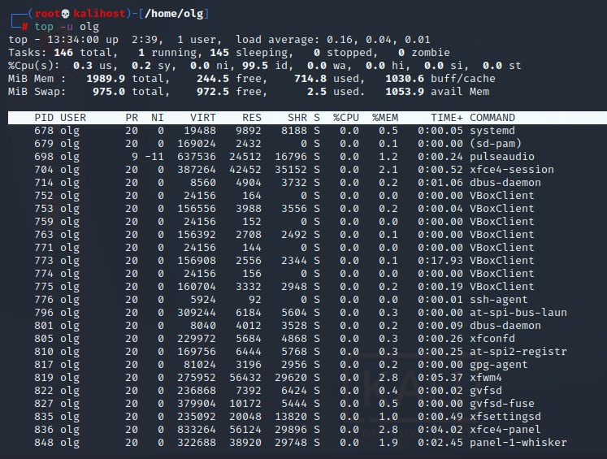

12. ### What interactive commands can be used to control the top command? Give a couple of examples.

* top -h - Shows top command syntax
* top -b - Batch Mode
* top -s - Secure Mode
* top -d seconds.tenths - 
* press z - option in running top command will display running process in color

13. ### Sort the contents of the processes window using various parameters (for example, the amount of processor time taken up, etc.)

* 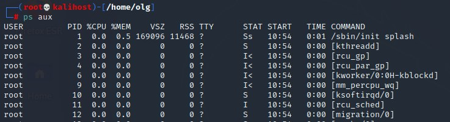
* 
* 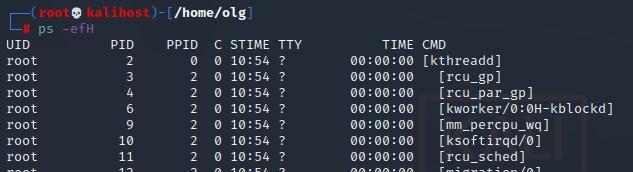
* 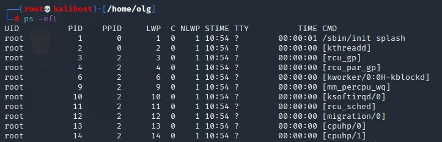
* 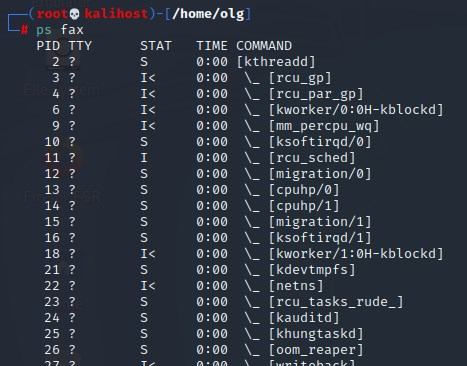
* 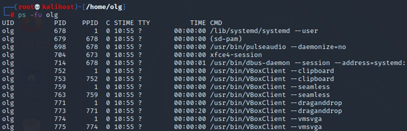

14. ### Concept of priority, what commands are used to set priority?

* The linux process priority means how much more CPU time will be devoted to this process compared to others. So we can very finely tune which program will run faster and which will be slower. The priority value can range from '19' (minimum priority) to '-20' - the maximum priority of the linux process. We can reduce the priority with the rights of a regular user, but to increase it, you need superuser rights.

* To set priority we can use command 'nice'. 
  Example 'nice -n 10 apt-get upgrade'

15. ### Can I change the priority of a process using the top command? If so, how?

* Use 'top' command, press r. Give PID value of the process to change the process value. Set renice value (from -20 to +19)

16. ### Examine the kill command. How to send with the kill command process control signal?  Give an example of commonly used signals.

* Basic template of 'kill' command it's 'kill options PID'
* 'kill 3012' - send SIGTERM to process ID 3012
* 'kill -KILL 3121' or 'kill -9 3121' - send  SIGKILL to process ID 3121
* 'kill -9 3012 3121 3142' - multiple kill of processes

17. ### Commands jobs, fg, bg, nohup. What are they for? Use the sleep, yes command to demonstrate the process control mechanism with fg, bg.

* This commands uses for background processes. 
* 'jobs -l' - show processes number and background ID of process, state of process
* 'fg' - back process from the background 
* 'bg' - change state of process to backgound
* 'nohup' - start a hang-protected command with output to non-tty (ignores loss of SIGHUP communications).
* 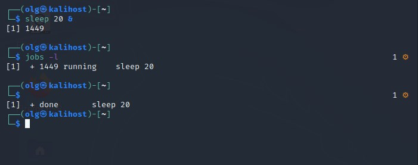
* 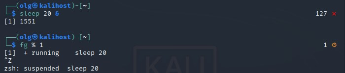

### Part 2
1. ### Check the implementability of the most frequently used OPENSSH commands in the MS Windows operating system. (Description of the expected result of the commands + screenshots: command – result should be presented)

* Check SSH install status
 'Get-WindowsCapability -Online | ? Name -like 'OpenSSH.Client*' 

* 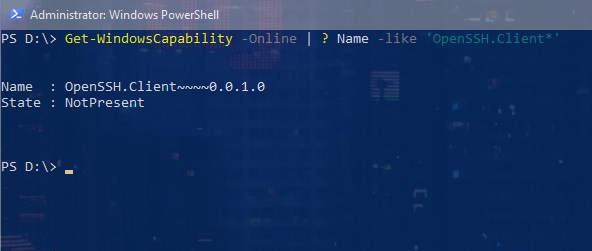

* If SSH not instaled we can use 
  'dism /Online /Add-Capability /CapabilityName:OpenSSH.Client~~~~0.0.1.0' in powershell

* 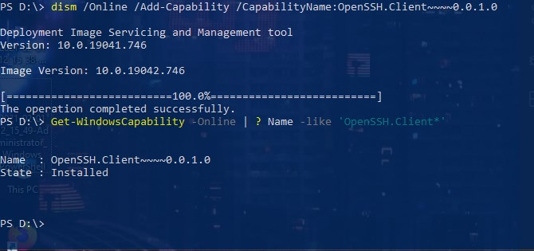

* 'ssh' show options of utility. If 'ssh' command not working after install, add path in env.

* 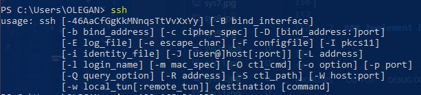

* 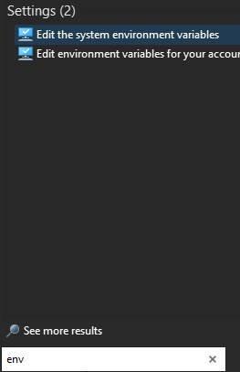

* 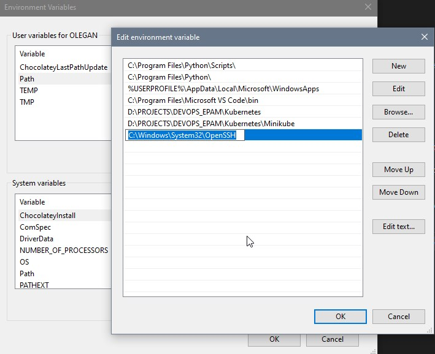

* 'ssh username@host' - default ssh connection (port 22)
* 'ssh username@host -p portnumber' - ssh connection with custom port
* 'ssh root@192.168.1.202' - connection to linux host under root

* Check ssh status and Connect to Kali from win10 by Mobaxterm

* 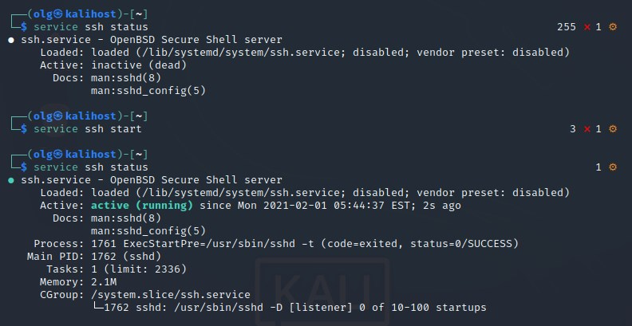

* 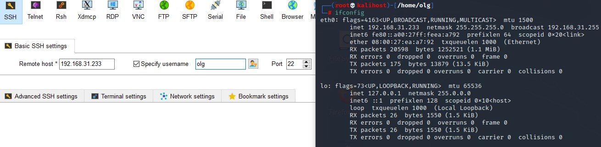

* 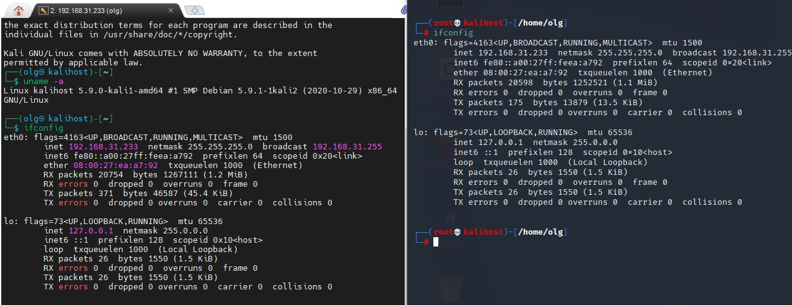

* Start ssh service on windows

* 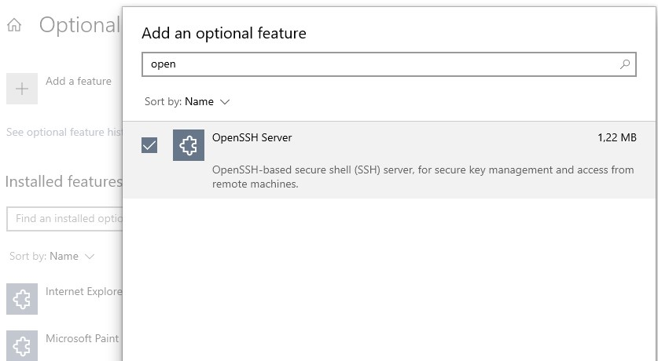

* 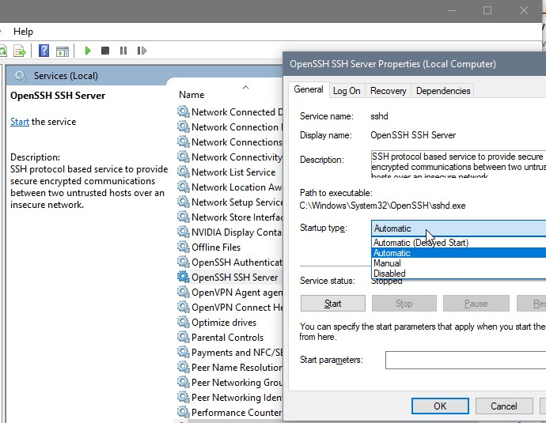

* Connect from kali(terminal) to win10 and from win10(moba)->to kali(in moba)->to win10

* 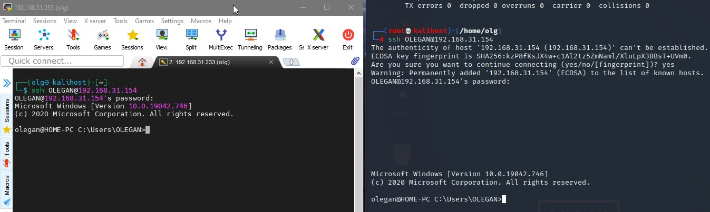

2. ### Implement basic SSH settings to increase the security of the client-server connection.

* We can change default port in 'nano /etc/ssh/sshd_config' and after retart ssh 'service sshd restart'

* Disable Empty Passwords, open /etc/ssh/sshd_config file and update the line:
  'PermitEmptyPasswords no'

* Also can change count of 'MaxAuthTries' and 'MaxSessions' in sshd

* Disable Root Logins. To disable Root Logins, we need to edit the SSHD configuration file. Open /etc/ssh/sshd_config file. Change line #PermitRootLogin to PermitRootLogin no

* Use only ssh protocol 2 
  'nano /etc/ssh/sshd_config' line #Protocol 2, 1 change to Protocol 2

* Open only to specific clients. 
  'iptables -A INPUT -p tcp -s specIP --dport 22 -j ACCEPT' open ony for specIP client.

  Also you can record all input IPs if ssh open globally
  'iptables -A INPUT -p tcp --dport 22 -m state --state NEW -m recent --set --name ssh –rsource'

  And verifies if that IP address has tried to connect three times or more within the last 90 seconds. If it hasn’t, then the packet is accepted.
  'iptables -A INPUT -p tcp --dport 22 -m state --state NEW -m recent ! --rcheck --seconds 90 --hitcount 3 --name ssh --rsource -j ACCEPT'

* Use keys for authentication. 
  Create key - 'ssh-keygen -t rsa' 

  Secure copy to remote-host - 'scp –p id_rsa.pub user@host'

  Copy public key right place - 'ssh remoteuser@remotehost mkdir ~/.ssh chmod 700 ~/.ssh cat id_rsa.pub >> ~/.ssh/authorized_keys chmod 600 ~/.ssh/authorized_keys mv id_rsa.pub ~/.ssh logout'

  Delete delete the public key from the server, otherwise the SSH client won’t allow to login to the server
  'rm id_rsa.pub'

  set file permissions on the server chmod '700 ~/.ssh chmod' and  '600 ~/.ssh/authorized_keys'

3. ### List the options for choosing keys for encryption in SSH. Implement 3 of them.

* We can find some key options in sshd_config file

* 

* Creating different keys
* Default rsa key

* 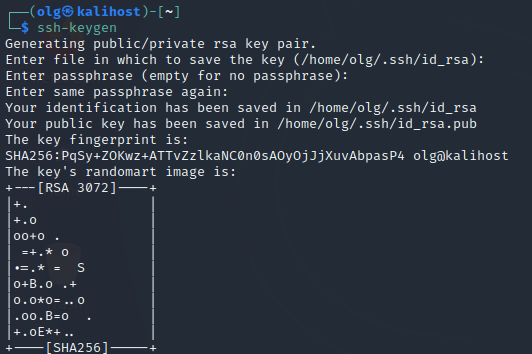

* 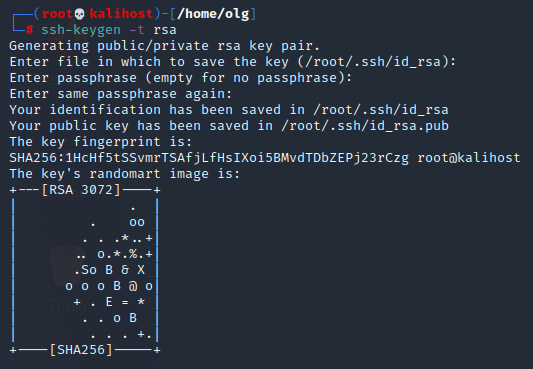

* RSA 4096

* 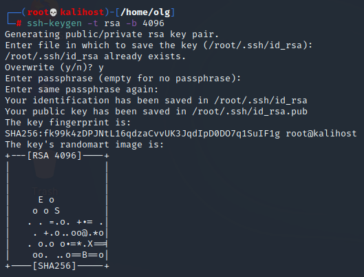

* RSA with multiple encripting, to help prevent brute force attack. And comment key.

* 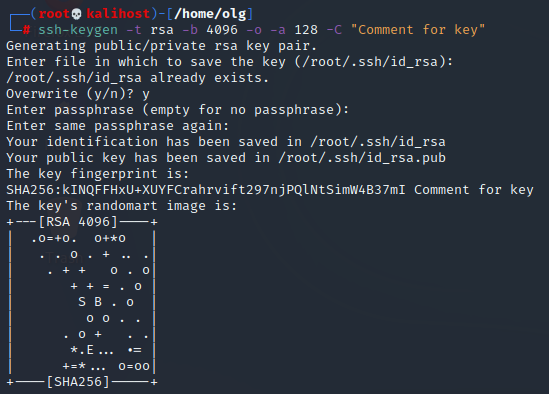

* More contemporary key Using the Edwards Twisted Curve algorithm we have the best of both sides, a small 256 bits key but very secure transfer due the nature of the key.

* 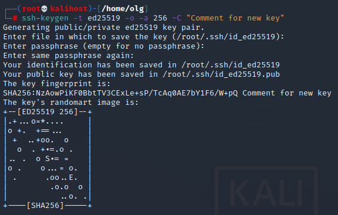

4. ### Implement port forwarding for the SSH client from the host machine to the guest Linux virtual machine behind NAT.

* Check ssh status, and IP address.

* 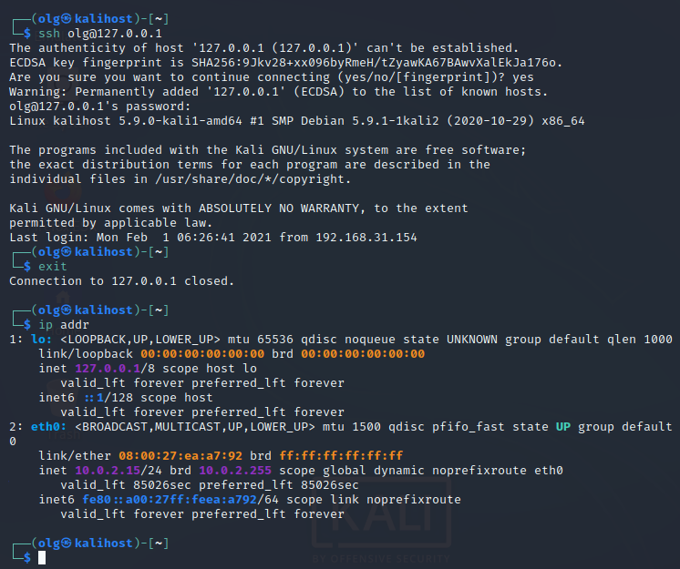

* In Network setings add config to port forwrding.

* 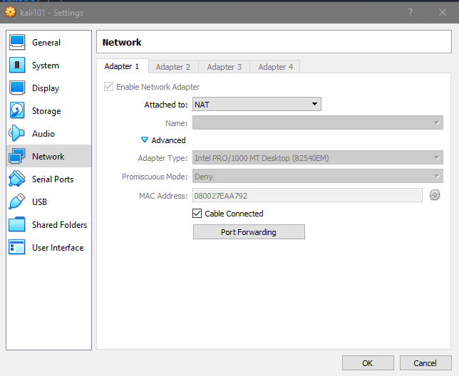
* 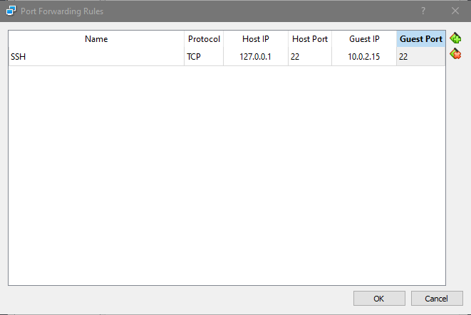

* Connусе to guest VM behind NAT

* 
* 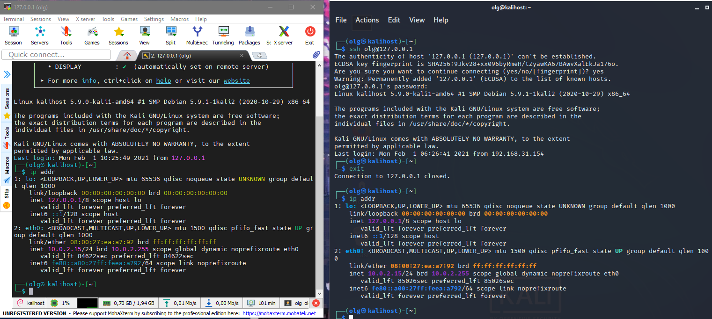

5. ### Intercept (capture) traffic (tcpdump, wireshark) while authorizing the remote client on the server using ssh, telnet, rlogin. Analyze the result.

* Connect to kali (VM) from Win10 (MobaXterm) using wireshark on kali 
* In sort packet logs (sshv2) we can see all stages of authorization, key exchange (clent-server), and exchange of encrypted packets.

* 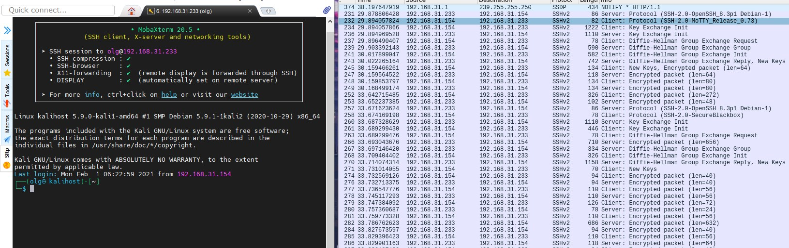

* 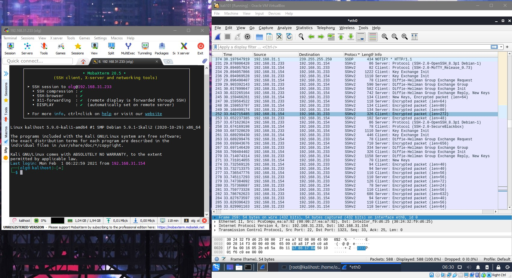

---------------------------------------------------------