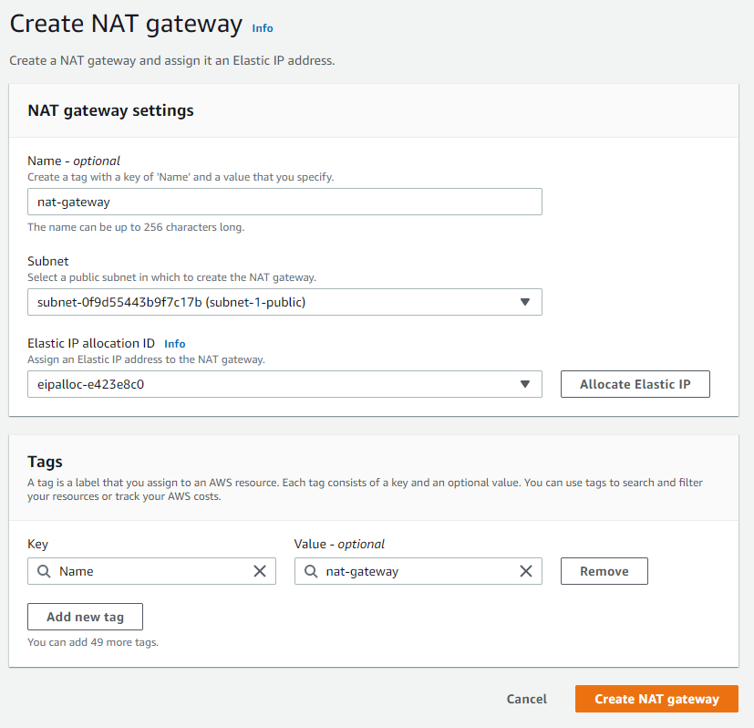

# Task 6.1

## Network 
### Make Task with AWS VPC 
### Using this model for VPC and instances

### 1. Creating VPC and Intenet gateway for VPC.

 
### 2. Creating 3 Subnets Public, Private(nat-internal), Internal(internal). Auto-assign public IP for Public subnet.

### 3. Create NAT gateway for Private(nat-internal) Subnet.

### 4. Edit and assossiate route tables for Public, Private(nat-iternal), Internal(internal) subnets.

### 5. Create Seccurity group for instances in VPC. 

### 6. Create Host(Bastion) in 'public' subnet and 2 instances in subnets 'nat-internal' and 'internnal'. Add created before sec group and pem key for all instances.

### 7. Checking and testing network.

