# Task 7.1

## Bash Scripts

### 1. Script A. Write script using nano, change chmod to 755, testing script and optins.

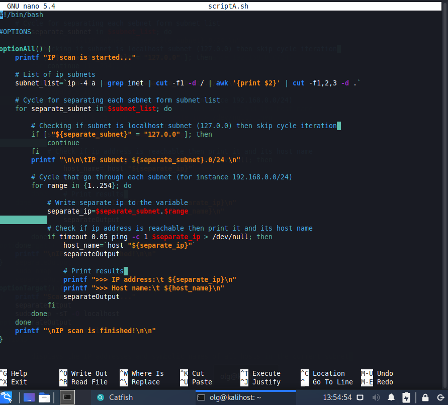

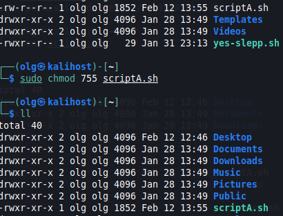

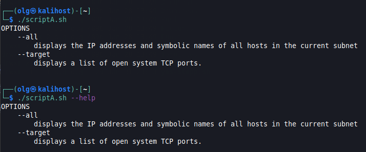

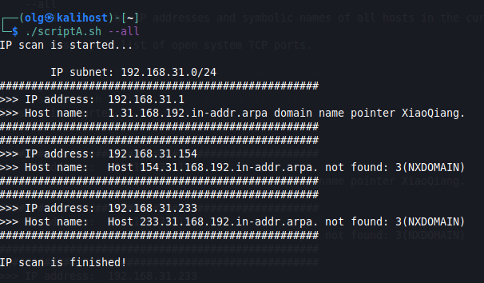

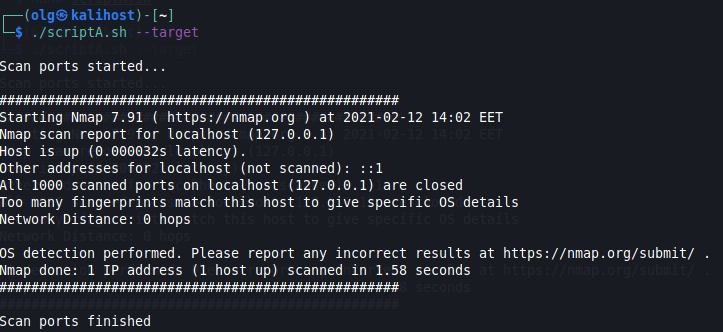

### 2. Script B. Testing script and opstions.

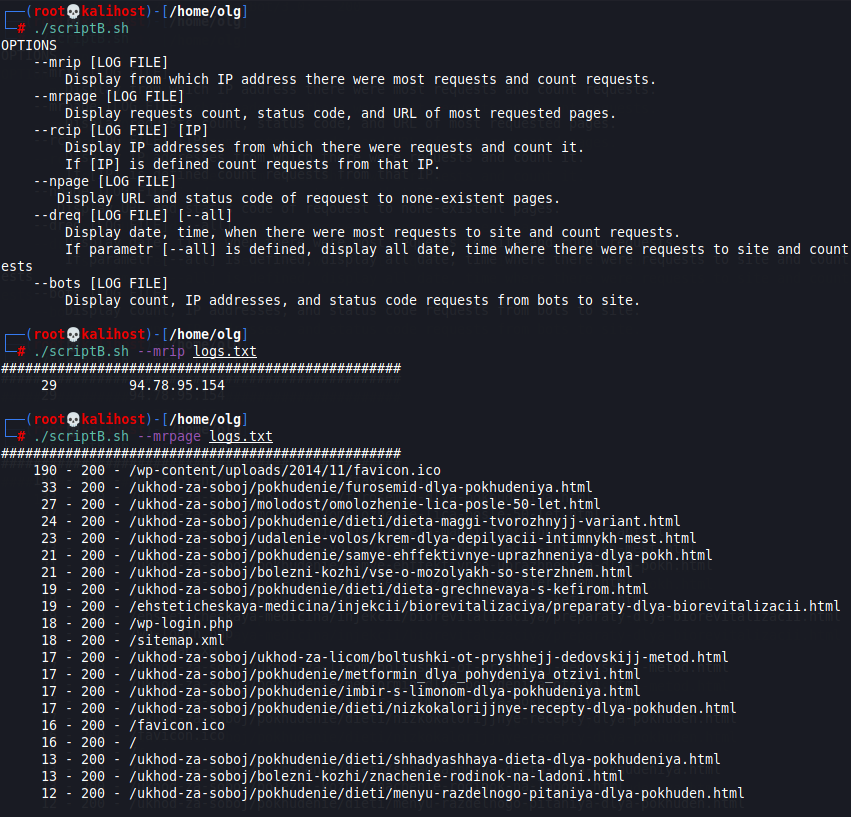

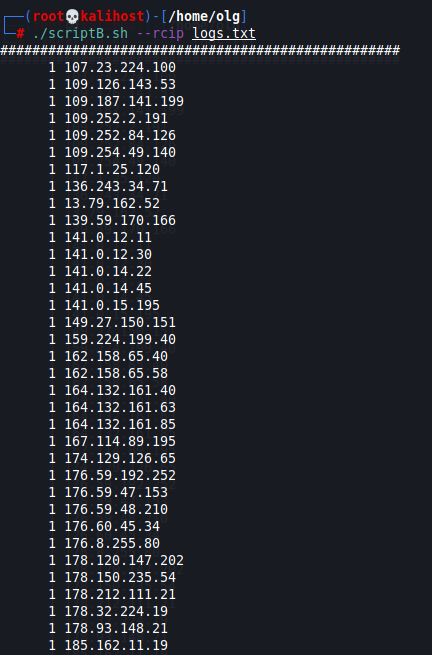

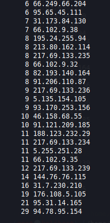

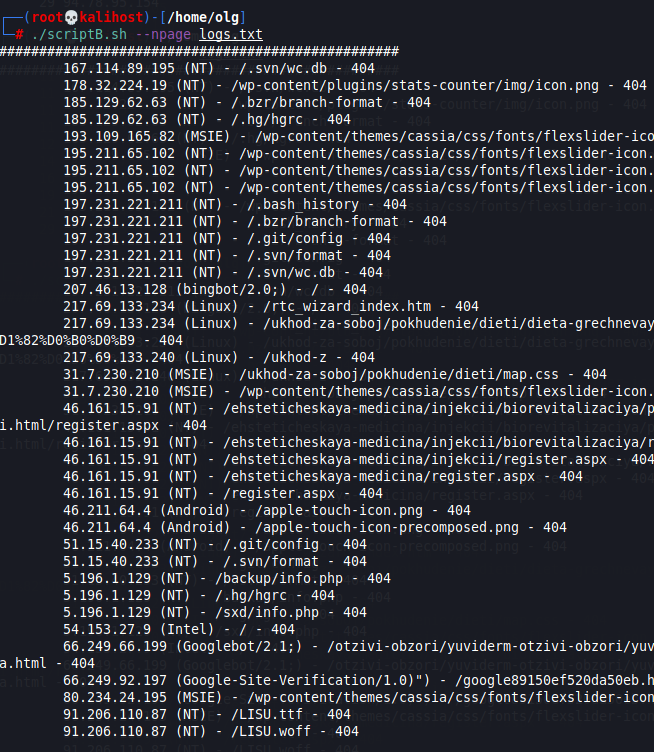

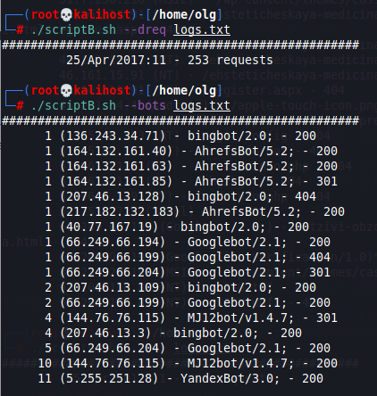

### 3. Script C. Testing script and opstions.

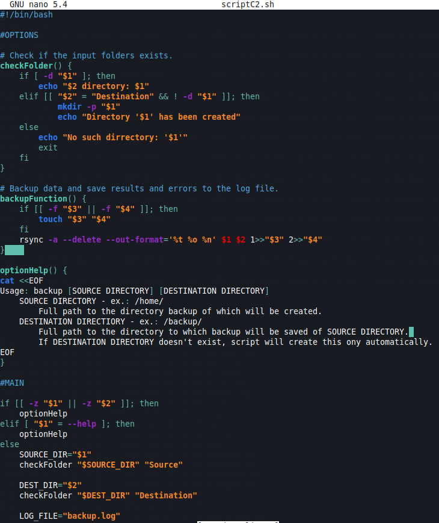

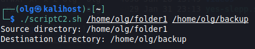

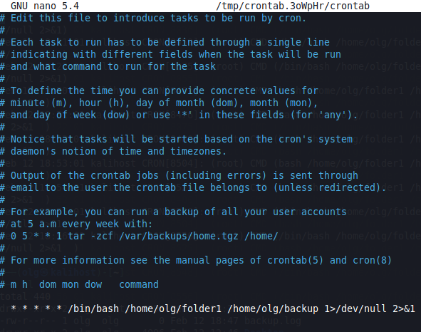

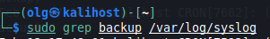

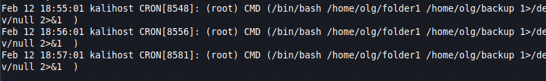

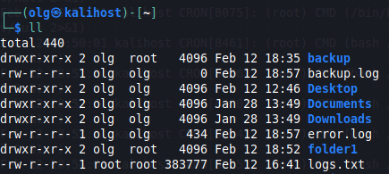

All scripts (.sh files) in task folder.
--------------------------------------
