# Task 8.1

## Jenkins CI/CD

### 1. Already created instance with Jenkins and Configure it. And create and configure deploy host. Install Apache, ssh, git.

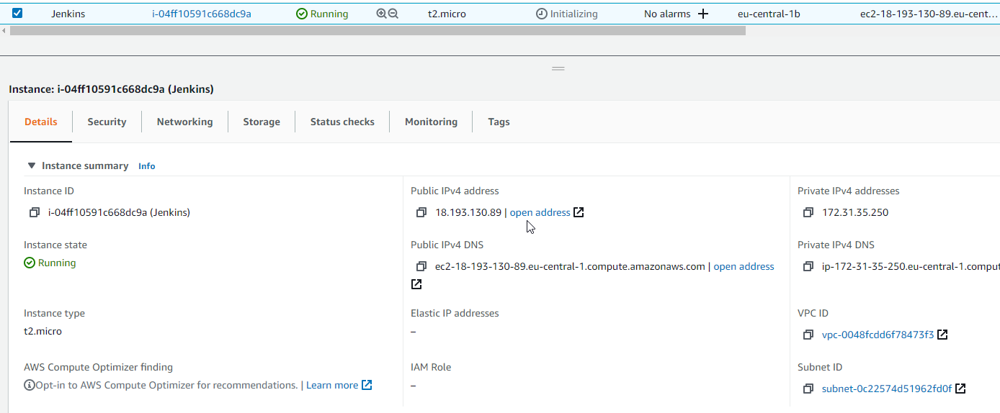

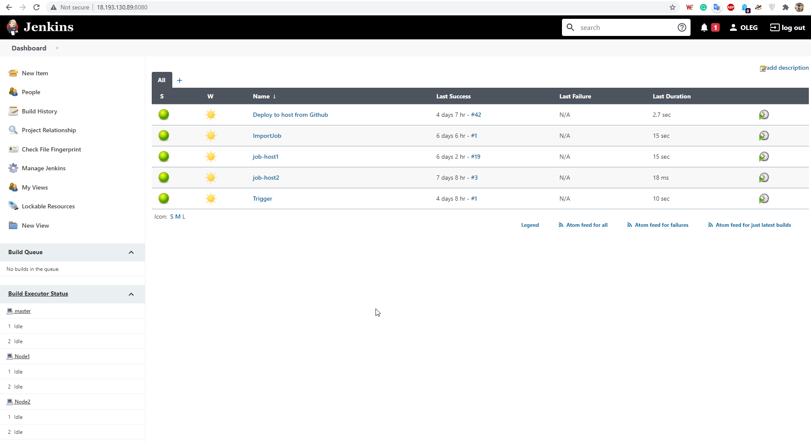

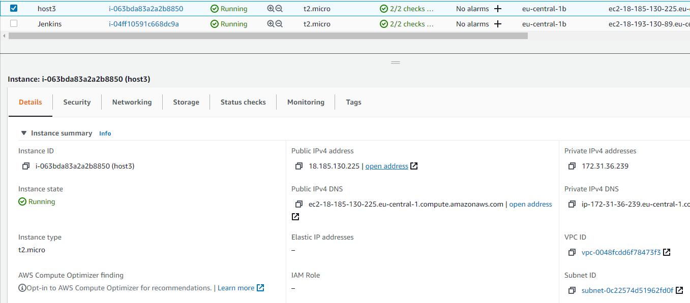

### 3. Configure "over SSH plugin" credentials. Add deploy host.

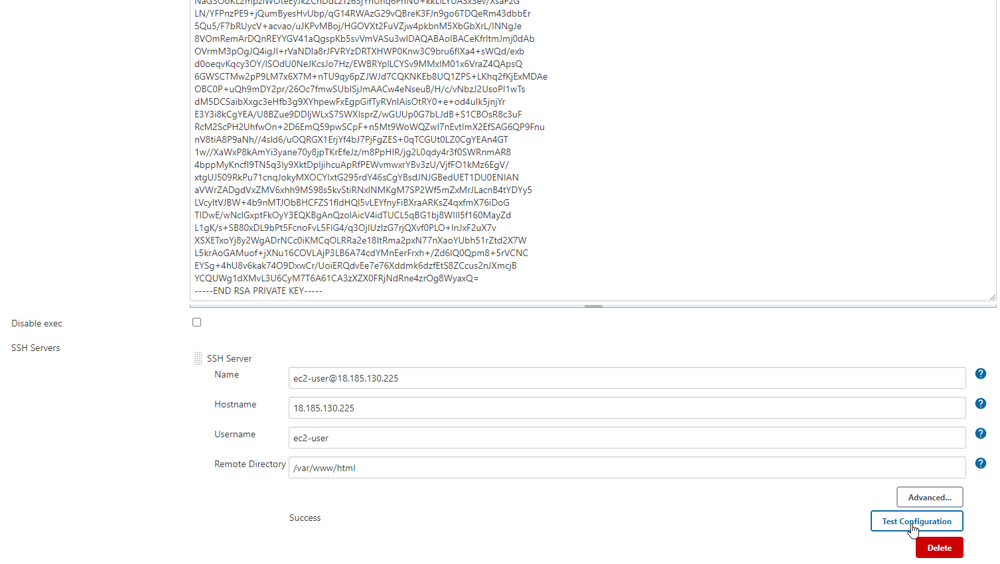

### 4. Configure project build. Add GitHub project. Use Github webhook for Jenkins build. Add ssh server for file copy.

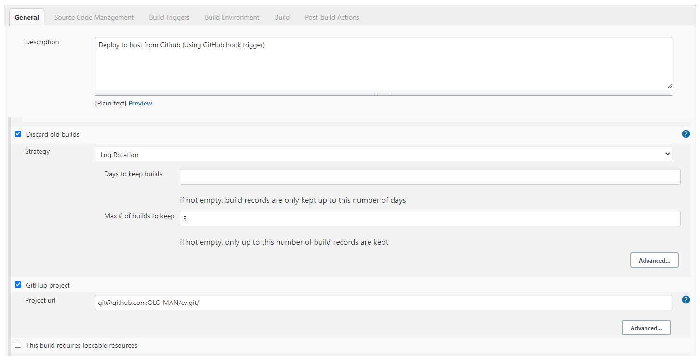

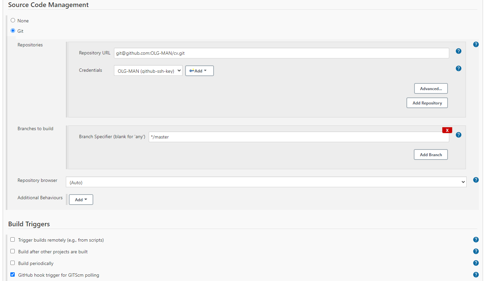

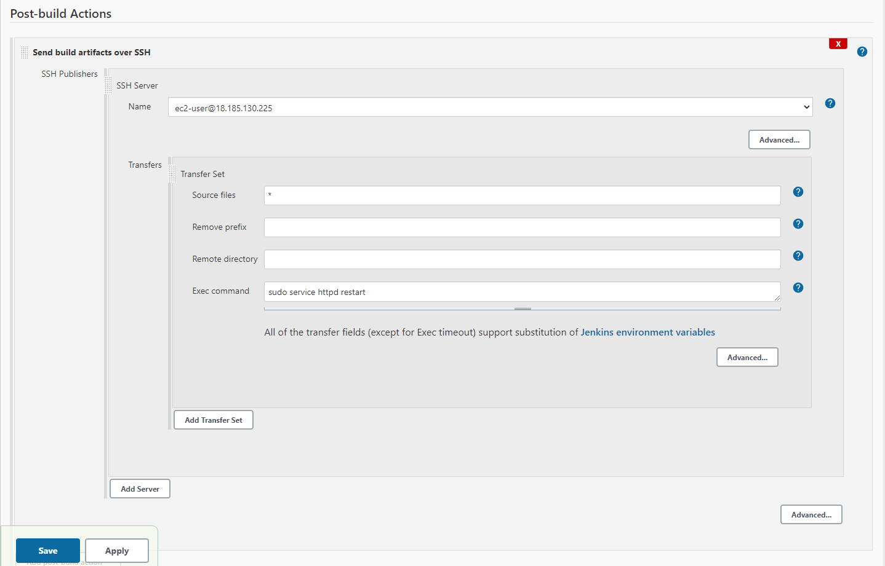

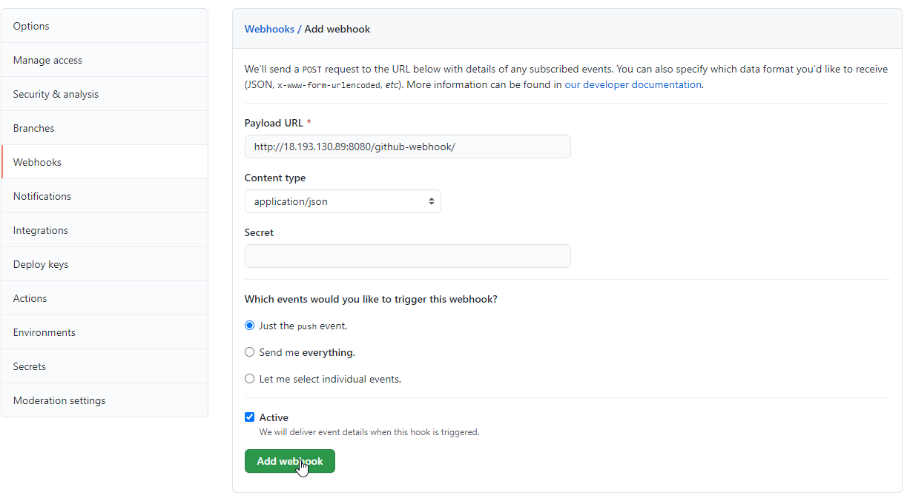

### 3. Check already deploy web page on deploy host. Copy Github repo to localhost for editing.  

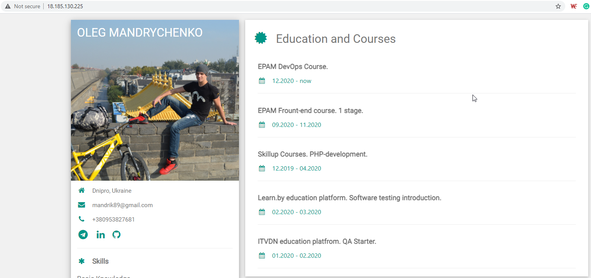

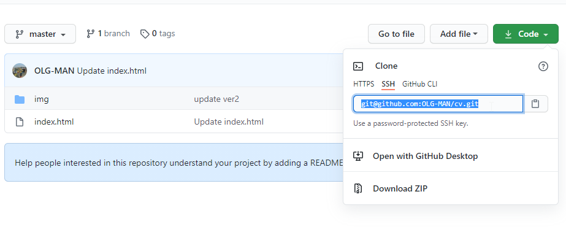

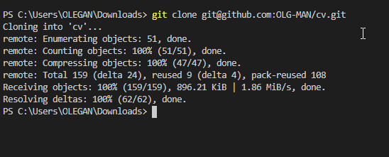

### 4. Editing webpage, change color in webpage blocks. Check on localhost.

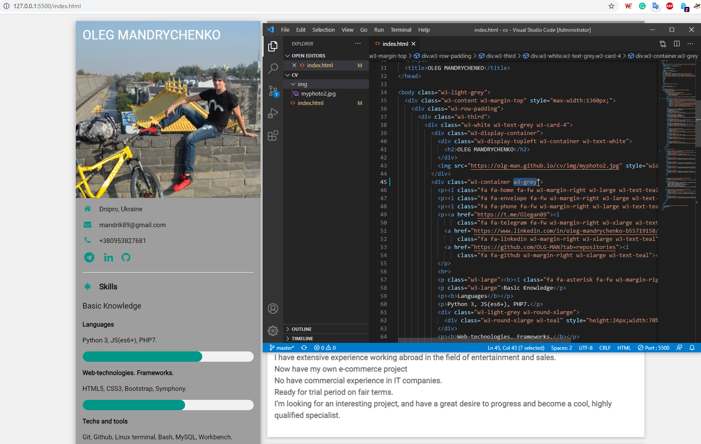

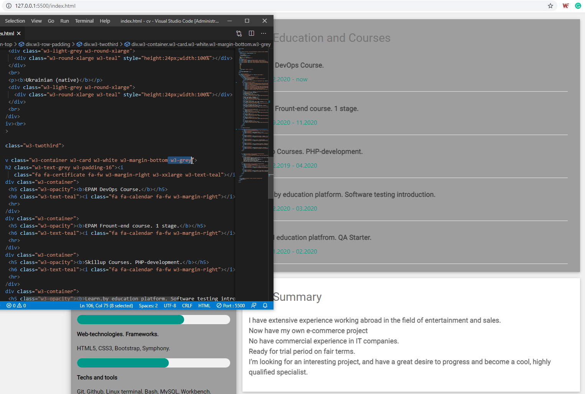

### 5. Push commit. Build started and successfully deployed on deploy host. Also have a small test in Jenkins build to check that word "EPAM" use two times in cv.

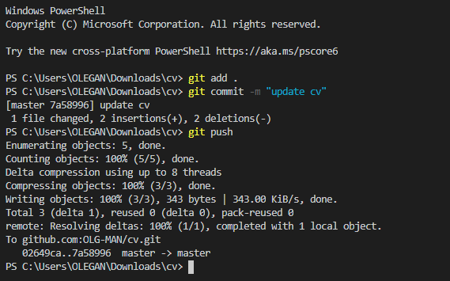

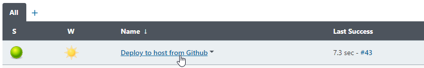

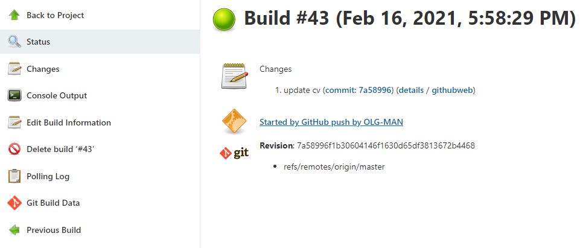

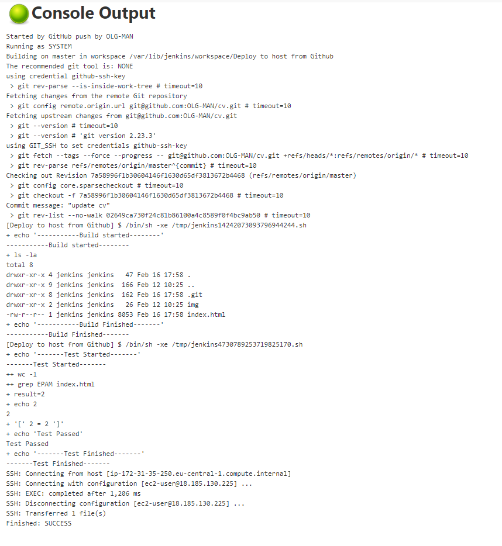

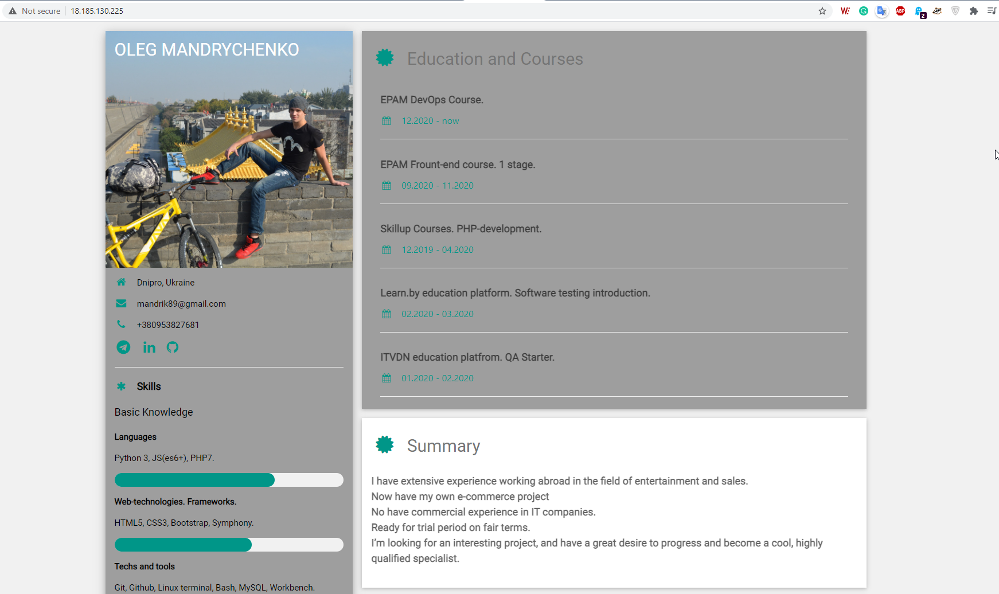

### P.S. This web-page(content) I'm will be not using in my final project, and a Jenkins pipeline would be different too. In the final project, I want to use Jenkins deploy to Kubernetes (now continuing learning this).

----------------------------------