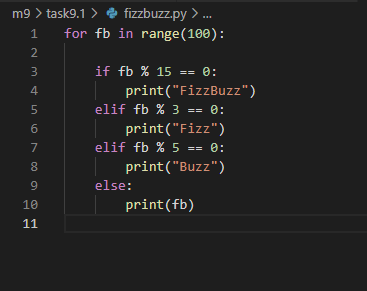
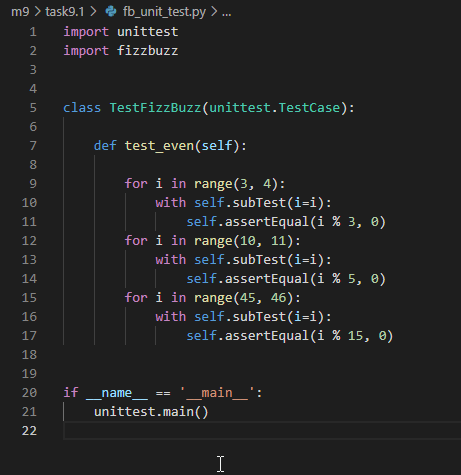
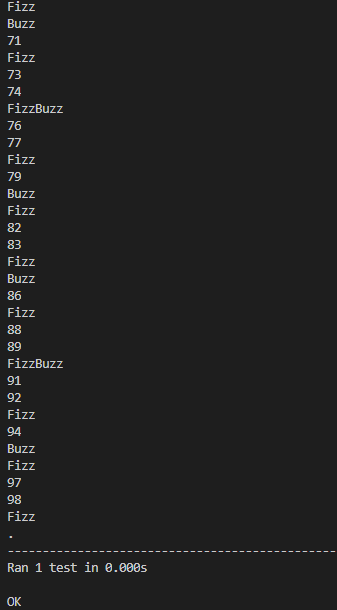
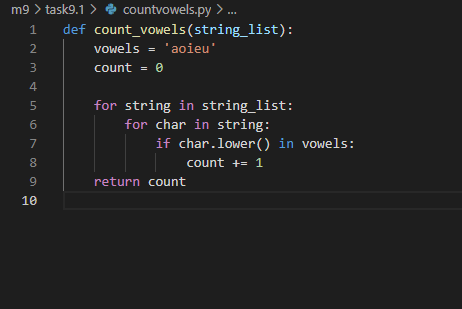
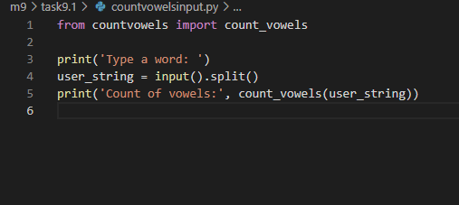
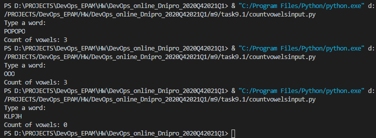

# Task 9.1

## Python

### 1. FizzBuzz function. Make FizzBuzz function through for loop. Make unit test to check target numbers (3, 10, 45) meet their division conditions, and accordingly give the desired answer (Fizz, Buzz, FizzBuzz)

### 2. Vowels function. Counting vowels in inpus string.

### All .py files in task folder
--------------------------------