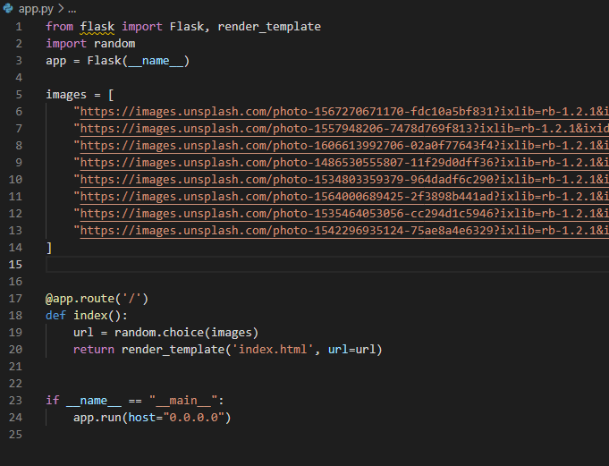

# Task 9.1

## Docker

### Build CatApp from presentation.

* Make folder and files

* Editing dockerfile and adding fresh links from unsplash to app.py

* Build image and run container (as a daemon and forwarding to port 80)

### All HW files in folder src
-------------------------------------------